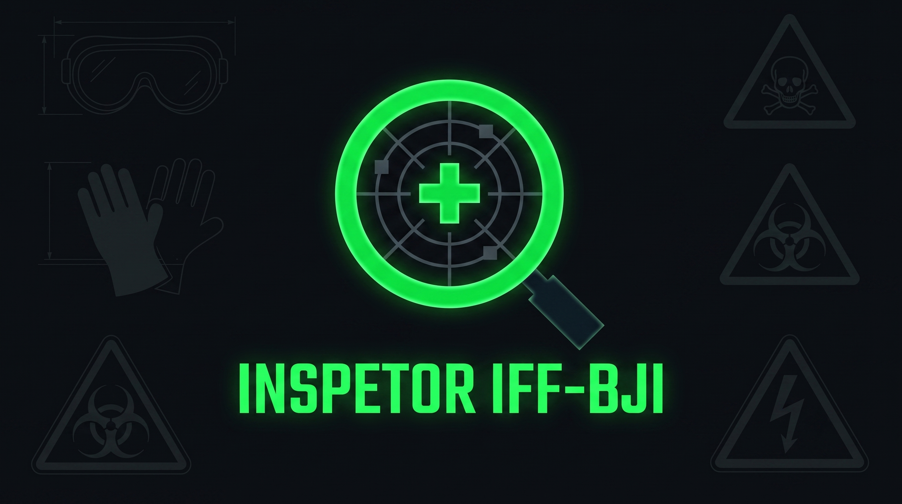
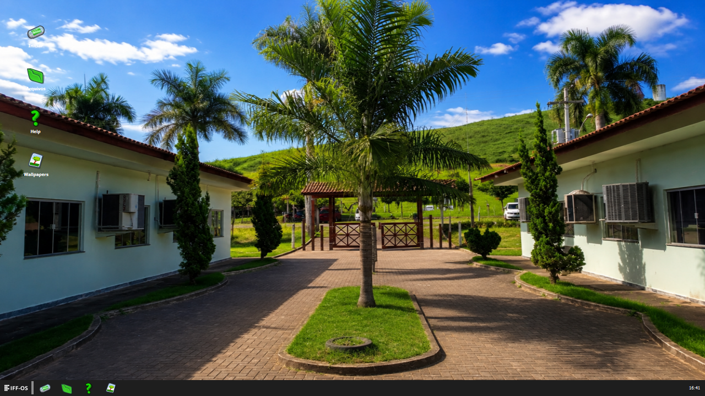
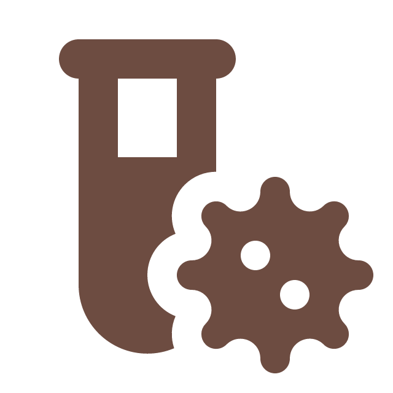

<p align="center">
  
</p>

# Inspetor IFF-BJI

[](https://www.python.org/downloads/)
[](LICENSE)
[]()

## Apresentação

**Inspetor IFF-BJI** é um simulador educacional para análise de risco ocupacional, desenvolvido como atividade de Curricularização da Extensão no Instituto Federal Fluminense (IFF), Campus Bom Jesus do Itabapoana, na disciplina de Higiene e Segurança do Trabalho.

O simulador é um **ambiente de prática imersivo** onde estudantes e profissionais de segurança do trabalho analisam cenários reais em laboratórios, oficinas e refeitórios, identificam riscos ocupacionais segundo a Norma Regulamentadora 26 (NR-26), classificam fatores de insegurança (atos e condições inseguras), e decidem a melhor estratégia administrativa (advertência, interdição ou arquivamento).

A avaliação ocorre sob pressão temporal, com retroalimentação imediata e uma pontuação determinística que premia **exatidão** (acertos nas classificações), **completude** (cobertura de todos os riscos) e **eficiência** (penalidade por decorrência de tempo), refletindo as exigências reais da profissão.

---

## 🎨 Interface e Gameplay

### Tela Inicial — Seleção de Perfil


*Escolha seu perfil de inspetor (persona) para definir o contexto da análise.*

### Elementos Visuais
<div align="center">

| Riscos Ocupacionais | Decisões Administrativas |
|---|---|
|      |     |

</div>

---

## 📋 Sumário

- [✨ Features](#-features)
- [🎮 Como Jogar](#-como-jogar)
- [🚀 Instalação Rápida](#-instalação-rápida)
- [📚 Documentação](#-documentação)
- [🏗️ Arquitetura](#-arquitetura)
- [📄 Licença](#-licença)
- [👥 Contribuidores](#-contribuidores)

---

## ✨ Características Distintivas

- **Modelo de avaliação determinístico** — Equação de pontuação explícita que premia exatidão (acertos nas classificações), completude (identificação de todos os riscos) e eficiência temporal. Sem aleatoriedade: mesma resposta sempre produz mesma nota.

- **Cenários baseados em casos reais** — Laboratórios, oficinas e refeitórios do IFF com relatórios autênticos, equipamentos e contextos que estudantes reconhecem.

- **Classificação normativa de riscos** — Cinco categorias segundo NR-26: Físico, Químico, Biológico, Ergonômico e Acidente, com cores específicas por fator de risco.

- **Decisões administrativas fundadas** — Três estratégias (Advertência, Interdição, Arquivamento) com consequências que refletem a escolha: erros reverberam na pontuação.

- **Pressão temporal realista** — Decaimento de pontuação conforme o tempo decorre, simulando urgência operacional.

- **Retroalimentação formativa** — Após cada decisão, diagnóstico detalhado: erros identificados, itens faltantes, pontuação por componente, oportunidade de aprender.

- **Guia integrado para primeiro acesso** — 8 slides interativos explicam mecânicas, termos e fluxo, sem exigir leitura externa.

- **Interface responsiva e acessível** — Tema claro/escuro, dimensionamento automático para diferentes resoluções, tipografia legível.

- **Arquitetura académica** — Clean Architecture (camadas Core, Infrastructure, Application, View) com separação rigorosa de responsabilidades, 615+ testes automatizados, código documentado.

---

## 🎮 Fluxo de Operação

O simulador segue um fluxo linear com avaliação ao final:

1. **Escolha de Perfil**: Seleção de persona (p.ex., Inspetor Diurno, Supervisor Noturno) — define contexto e conhecimento prévio.

2. **Apresentação do Caso**: Relatório estruturado com local, atividade, envolvidos, descrição narrativa da situação. Acesso a anexos (fotos, vídeos) se relevantes.

3. **Identificação de Riscos**: Marcação de riscos observados. O sistema lista os riscos possíveis por cores (NR-26: azul=físico, vermelho=acidente, etc.). Objetivo: máxima cobertura com mínimos falsos positivos.

4. **Classificação de Insegurança**: Tipo de risco identificado — **Ato Inseguro** (comportamento inadequado) vs. **Condição Insegura** (ambiente/equipamento inadequado). Exige compreensão normativa.

5. **Decisão Administrativa**: Escolha de ação corretiva única:
   - **Advertência**: Para riscos menores (reforço comportamental)
   - **Interdição**: Para riscos graves (suspensão da atividade até correção)
   - **Arquivamento**: Para situações sem risco efetivo (falso positivo intencional ou erro)

6. **Cálculo e Retroalimentação**: Sistema calcula pontuação segundo equação determinística. Apresenta análise item-por-item, erros cometidos, lacunas, e sugestões de melhoria.

7. **Prática Iterada**: Múltiplos cenários disponíveis, recomenda-se repetição para consolidação de expertise.

**Métrica de Sucesso**: Pontuação máxima = análise completa (todos os riscos), precisa (sem falsos positivos) e eficiente (dentro do tempo limite).

---

## 🚀 Instalação Rápida

**Pré-requisitos:** Python 3.11+

### Opção 1: Via Git (recomendado para desenvolvimento)

```bash
git clone https://github.com/WelingtonPeres/Inspetor_IFF_BJI.git
cd Inspetor_IFF_BJI
python -m venv venv
# Windows (PowerShell): .\venv\Scripts\Activate.ps1
# Linux/macOS:          source venv/bin/activate
pip install -r requirements.txt
python main.py
```

### Opção 2: Download do ZIP (sem Git)

1. Acesse [Releases](https://github.com/WelingtonPeres/Inspetor_IFF_BJI/releases) ou clique no botão **Code** > **Download ZIP**
2. Extraia o arquivo em uma pasta de sua escolha
3. Abra o terminal/PowerShell na pasta extraída
4. Execute:

```bash
python -m venv venv
# Windows (PowerShell): .\venv\Scripts\Activate.ps1
# Linux/macOS:          source venv/bin/activate
pip install -r requirements.txt
python main.py
```

**Dúvidas?** Consulte o [Guia de Contribuição](CONTRIBUTING.md) para detalhes de ambiente, dependências e troubleshooting.

---

## 📚 Documentação

Toda a documentação técnica vive em [`docs/`](docs/README.md), organizada por tema:

| Pergunta | Link |
|----------|------|
| **Como contribuo?** | [Guia de Contribuição](CONTRIBUTING.md) |
| **Como o código é organizado?** | [Arquitetura da Camada View](docs/arquitetura/view.md), [Diagrama de Classes](docs/arquitetura/diagrama-classes.md) |
| **Como o jogo funciona?** | [Modelagem Matemática](docs/game-design/modelagem-matematica.md), [Level Design](docs/game-design/level-design.md) |
| **Qual é o schema dos dados?** | [Estrutura JSON](docs/dados/estrutura-json.md) |
| **Qual é o padrão de código?** | [Nomenclatura e PEP-8](docs/processo/nomenclatura-pep8.md) |
| **Quer revisar PRs?** | [Checklist de Code Review](docs/arquitetura/checklist-revisao.md) |

**Índice completo**: [docs/README.md](docs/README.md)

---

## 🏗️ Arquitetura de Software

O projeto implementa **Arquitetura Limpa** (Clean Architecture, Robert C. Martin), organizando o código em **camadas concêntricas** com dependências unidirecionais (sempre para dentro):

| Camada | Diretório | Responsabilidade | Dependências |
|--------|-----------|------------------|--------------|
| **Core (Domain)** | `core/model/`, `core/services/`, `core/dtos/` | Entidades, regras de negócio, algoritmos de cálculo (p.ex., equação de pontuação) | ✋ Nenhuma externa |
| **Infrastructure** | `infrastructure/` | Implementação de repositórios, persistência em JSON, fábrica de cenários | Core apenas |
| **Application** | `application/controllers/` | Orquestração de casos de uso, sequencialização de eventos, contrato `IGameView` | Core + Infrastructure |
| **View** | `view/` | Interface com o utilizador (PySide6/Qt), widgets, estilos, sinalização | Application apenas (via contrato) |
| **Config** | `config/` | Configuração centralizada (logging, caminhos, valores de ambiente) | Acessível a todas |

**Propriedades:**
- **Alta coesão**: Cada camada tem uma única razão para mudar
- **Baixo acoplamento**: Dependências fluem inward; camadas internas não conhecem externas
- **Testabilidade**: Core pode ser testado sem Qt, infraestrutura sem UI
- **Manutenibilidade**: Mudanças na UI não afetam cálculos de negócio

**Leitura completa**: [Clean Architecture](docs/arquitetura/clean-architecture.md), [Diagrama de Classes](docs/arquitetura/diagrama-classes.md), [Padrões da View](docs/arquitetura/view.md)

---

## 📄 Licença

Este projeto está licenciado sob a **Creative Commons Attribution-NonCommercial-ShareAlike 4.0 International License** (CC BY-NC-SA 4.0).

**O que você pode fazer:**
- ✓ Usar, copiar e redistribuir
- ✓ Remixar, transformar e melhorar
- ✓ Usar em contextos educacionais

**Com a condição de:**
- Atribuir crédito ao IFF e aos autores
- Não usar para fins comerciais
- Compartilhar derivados sob a mesma licença

Para o texto legal completo, veja [LICENSE](LICENSE).

---

## 👥 Contribuidores

Veja [AUTHORS.md](AUTHORS.md) para lista completa de contribuidores, orientadores e instituições envolvidas.

### Como Contribuir

O projeto está em **desenvolvimento ativo** e aceita contribuições! 

1. Leia [CONTRIBUTING.md](CONTRIBUTING.md) para diretrizes
2. Abra uma [Issue](https://github.com/WelingtonPeres/Inspetor_IFF_BJI/issues) para reportar bugs ou propor features
3. Envie um [Pull Request](https://github.com/WelingtonPeres/Inspetor_IFF_BJI/pulls) com suas melhorias
4. Siga os [padrões de código](docs/processo/nomenclatura-pep8.md) do projeto

---

## 📊 Status do Projeto

| Aspecto | Status |
|---------|--------|
| **Desenvolvimento** | 🟢 Ativo — novas features e melhorias contínuas |
| **Estabilidade** | 🟡 Beta — testado mas em refinamento |
| **Testes** | 🟢 615+ testes automatizados passando |
| **Documentação** | 🟢 Completa e atualizada |
| **Licença** | 🟢 CC BY-NC-SA 4.0 |

---

## 🎓 Contexto Institucional e Académico

### Origem

Inspetor IFF-BJI é desenvolvido no **Instituto Federal Fluminense (IFF)**, Campus Bom Jesus do Itabapoana, como **Atividade de Curricularização da Extensão** — iniciativa que integra pesquisa, ensino e extensão conforme diretrizes institucionais.

**Curso:** Engenharia de Computação  
**Disciplina-sede:** Higiene e Segurança do Trabalho  
**Objetivo pedagógico:** Criar ambiente prático, seguro e repetível para que aprendizes internalizem critérios de análise de risco ocupacional — competência essencial para profissionais de segurança do trabalho.

### Justificativa Educacional

A análise de risco é uma atividade cognitiva complexa que exige integração de conhecimentos técnicos, normativos (NRs) e de tomada de decisão. O simulador oferece:

- **Prática sem riscos**: Estudantes enfrentam cenários reais sem colocar-se em risco
- **Feedback imediato**: Aprendem consequências de suas decisões instantaneamente
- **Escala de dificuldade**: Possibilidade de progredir em complexidade conforme ganham expertise
- **Acesso democrático**: Ferramenta aberta (CC BY-NC-SA), reutilizável por outros IFs e instituições de ensino profissional

### Referência

> BRASIL. Lei nº 11.788, de 25 de setembro de 2008. Dispõe sobre o estágio de estudantes; altera a redação do art. 428 da Consolidação das Leis do Trabalho (CLT) [...]. Diário Oficial da União, Brasília, 2008.

Legislação sobre prática profissional; este projeto permite prática simulada.

---

**Última atualização:** Agosto de 2026  
**Instituição:** Instituto Federal Fluminense, Campus Bom Jesus do Itabapoana  
**Curso:** Engenharia de Computação  
**Créditos:** Veja [AUTHORS.md](AUTHORS.md)
