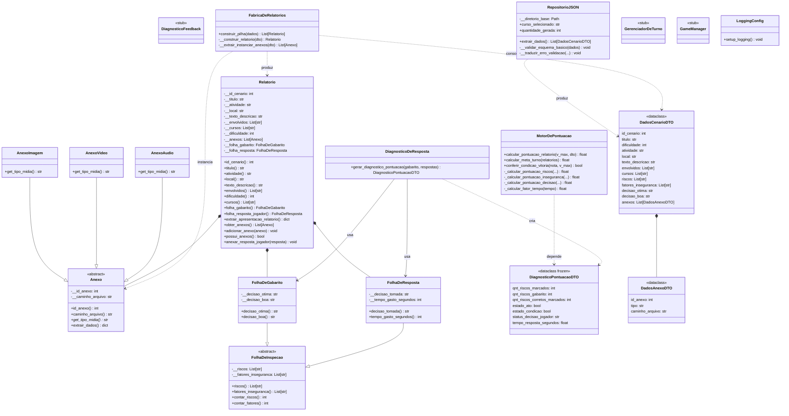

# Inspetor IFF-BJI: Análise de Risco

## 1. Contexto Institucional e Extensão Curricular

Este projeto de software foi desenvolvido como atividade integrante da **Curricularização da Extensão** do Curso de **Bacharelado em Engenharia de Computação** do **Instituto Federal Fluminense (IFF) - Campus Bom Jesus do Itabapoana**, desenvolvida na disciplina de **Higiene e Segurança do Trabalho**, na grade do 8° período.

A iniciativa cumpre o papel fundamental de estender o conhecimento acadêmico gerado na instituição para a sociedade, integrando conceitos avançados de Engenharia de Computação a uma aplicação prática de Segurança do Trabalho. O sistema possui potencial direto para ser utilizado em treinamentos internos de servidores e alunos, além de capacitações externas em empresas e comunidades da região.

## 2. Apresentação do Sistema

O **Inspetor IFF-BJI: Análise de Risco** é um simulador interativo baseado na rotina técnica de um Técnico de Segurança do Trabalho dentro do ambiente do Instituto Federal Fluminense. 

No papel de um inspetor, o usuário é responsável por analisar relatórios diários, inspecionar evidências de cenários de risco em dependências institucionais, como laboratórios, oficinas e refeitórios, e tomar decisões administrativas cabíveis sob forte pressão de tempo.

A abordagem do sistema afasta-se de dinâmicas puramente recreativas ou baseadas em aleatoriedade (jogos convencionais), fundamentando-se em um **modelo matemático determinístico e avaliativo** estruturado para mensurar o desempenho técnico real do operador.

##  Documentação do Projeto e Guias

Para manter este ficheiro principal conciso, toda a documentação técnica, especificações matemáticas e guias de desenvolvimento foram modularizados. Consulte os links abaixo para compreender a fundo os detalhes do projeto:

* **[Guia de Contribuição (CONTRIBUTING.md)](CONTRIBUTING.md)**: Como configurar o ambiente local, pré-requisitos e regras para submissão de Pull Requests.
* **[Modelagem Matemática e Algoritmos](docs/MODELAGEM_MATEMATICA.md)**: Detalhamento das equações de pontuação, cálculo de exatidão e fator de decaimento temporal.
* **[Estrutura de Dados e Schema JSON](docs/ESTRUTURA_JSON.md)**: Arquitetura e tipagem dos ficheiros de persistência de cenários e relatórios.
* **[Level Design e Fluxos do Jogo](docs/Level_Design.md)**: Mapeamento da experiência do utilizador, progressão de dificuldade e mecânicas de feedback.
* **[Padrões de Nomenclatura e PEP-8](docs/PADROES_NOMENCLATURA_PEP8.md)**: Diretrizes estritas de estilo de código adotadas pela equipa de engenharia.

##  Arquitetura do Projeto (Diagrama de Classes)

O projeto segue os princípios da **Arquitetura Limpa (Clean Architecture)**, dividido em camadas concêntricas:

### Legenda das Camadas

| Camada | Diretório | Responsabilidade |
|--------|-----------|------------------|
| **Core (Domain)** | `core/model/`, `core/services/`, `core/dtos/` | Regras de negócio e entidades — **sem dependências externas** |
| **Infrastructure** | `infrastructure/` | Repositório, fábrica e DTOs de persistência |
| **Application** | `application/controllers/` | Orquestração dos casos de uso (em implementação) |
| **View** | `view/` | Interface com o utilizador (PySide6) |
| **Config** | `config/` | Configuração centralizada (logging, etc.) |
