<p align="center">
  
</p>

# Inspetor IFF-BJI

> Simulador de análise de risco ocupacional desenvolvido no IFF, Campus Bom Jesus do Itabapoana, como atividade de Curricularização da Extensão na disciplina de Higiene e Segurança do Trabalho. O jogador recebe relatórios de cenários reais em laboratórios, oficinas e refeitórios, classifica riscos e fatores de insegurança, e escolhe a intervenção cabível sob pressão de tempo. A nota sai de um modelo determinístico que pondera exatidão, completude e decaimento temporal, e o resultado reflete o que um técnico de segurança faria naquele contexto.

## Sumário

- [1. Instalação](#1-instalação)
- [2. Documentação e Guias](#2-documentação-e-guias)
- [3. Arquitetura do Projeto](#3-arquitetura-do-projeto)

## 1. Instalação

### Pré-requisitos

| Recurso | Necessário para | Como verificar |
|---|---|---|
| **Python 3.11+** | Executar o jogo | `python --version` (Windows/Linux) ou `python3 --version` (macOS) |
| **Git** | Opção A (clone) | `git --version` |

> O **Git não é obrigatório**: quem prefere não instalar pode usar a **Opção B (ZIP)**.
> Em qualquer opção, o jogo é instalado numa pasta própria sem alterar o resto do sistema.

### Opção A — Instalar com Git (recomendado)

Recomendado porque facilita atualizar o jogo (`git pull`) e acompanhar o desenvolvimento.

**1. Abra o terminal** e clone o repositório:

```bash
git clone https://github.com/WelingtonPeres/Inspetor_IFF_BJI.git
cd Inspetor_IFF_BJI
```

**2. Crie o ambiente virtual** (isolamento das dependências do sistema):

```bash
python -m venv venv
```

**3. Ative o ambiente virtual** — o comando muda conforme o sistema:

| Sistema | Comando |
|---|---|
| Windows (PowerShell) | `.\venv\Scripts\Activate.ps1` |
| Windows (Prompt de Comando) | `.\venv\Scripts\activate.bat` |
| Linux/macOS | `source venv/bin/activate` |

Depois de ativar, o terminal passa a exibir `(venv)` no início da linha.

**4. Instale as dependências:**

```bash
pip install -r requirements.txt
```

**5. Inicie o jogo:**

```bash
python main.py
```

**Atualizar o jogo depois** (dentro da pasta, com o `venv` ativado):

```bash
git pull
```

### Opção B — Instalar pelo arquivo ZIP (sem Git)

**1. Baixe o arquivo ZIP:** acesse [github.com/WelingtonPeres/Inspetor_IFF_BJI](https://github.com/WelingtonPeres/Inspetor_IFF_BJI), clique no botão verde **"Code"** e escolha **"Download ZIP"**. O link direto é:

```
https://github.com/WelingtonPeres/Inspetor_IFF_BJI/archive/refs/heads/main.zip
```

**2. Extraia o conteúdo** do ZIP para uma pasta de sua preferência (ex.: `C:\Inspetor_IFF_BJI` ou `~/Inspetor_IFF_BJI`). A pasta extraída contém o projeto completo.

**3. Abra o terminal na pasta extraída** (dentro de `Inspetor_IFF_BJI-main`, a pasta que contém o `requirements.txt`):

```bash
cd caminho/para/Inspetor_IFF_BJI-main
```

**4. Crie o ambiente virtual:**

```bash
python -m venv venv
```

**5. Ative o ambiente virtual:**

| Sistema | Comando |
|---|---|
| Windows (PowerShell) | `.\venv\Scripts\Activate.ps1` |
| Windows (Prompt de Comando) | `.\venv\Scripts\activate.bat` |
| Linux/macOS | `source venv/bin/activate` |

**6. Instale as dependências:**

```bash
pip install -r requirements.txt
```

**7. Inicie o jogo:**

```bash
python main.py
```

> **Nota:** com o ZIP, atualizar o jogo significa baixar o ZIP novamente e repetir os passos 1–6. Para receber atualizações com um único comando, prefira a Opção A.

### Solução de problemas

| Problema | Causa provável | Solução |
|---|---|---|
| `'python' não é reconhecido` | Python fora do `PATH` | Reinstale o Python marcando **"Add Python to PATH"** ou use `py -m venv venv` no Windows |
| `Não é possível carregar ... porque a execução de scripts está desabilitada` (PowerShell) | Execution Policy do Windows | Rode `Set-ExecutionPolicy -Scope CurrentUser RemoteSigned` e tente de novo |
| `pip` acusa versão antiga | `pip` desatualizado | `python -m pip install --upgrade pip` |
| Erros de importação ao iniciar | Dependências incompletas | Reexecute `pip install -r requirements.txt` com o `venv` ativado |


## 2. Documentação do Projeto e Guias

Para manter este ficheiro principal conciso, toda a documentação técnica, especificações matemáticas e guias de desenvolvimento foram modularizados. Consulte os links abaixo para compreender a fundo os detalhes do projeto:

* **[Guia de Contribuição (CONTRIBUTING.md)](CONTRIBUTING.md)**: Como configurar o ambiente local, pré-requisitos e regras para submissão de Pull Requests.
* **[Arquitetura Limpa](docs/CLEAN_ARCHITECTURE.md)**: Mapa de camadas, responsabilidades, regras de dependência e organização do código-fonte.
* **[Manual de Revisão de Arquitetura](docs/CLEAN_ARCHITECTURE_CHECKLIST.md)**: Guia de code review com as 5 Perguntas Fundamentais antes de qualquer merge.
* **[Arquitetura da Camada View (MVP)](docs/ARQUITETURA_VIEW.md)**: Padrões de apresentação em PySide6 — widgets, signals/slots e contratos de interface.
* **[Git Flow (Versionamento)](docs/GITFLOW.md)**: Fluxo de branches eternas e efémeras adotado pela equipa.
* **[Modelagem Matemática e Algoritmos](docs/game_design/MODELAGEM_MATEMATICA.md)**: Detalhamento das equações de pontuação, cálculo de exatidão e fator de decaimento temporal.
* **[Estrutura de Dados e Schema JSON](docs/ESTRUTURA_JSON.md)**: Arquitetura e tipagem dos ficheiros de persistência de cenários e relatórios.
* **[Level Design e Fluxos do Jogo](docs/game_design/Level_Design.md)**: Mapeamento da experiência do utilizador, progressão de dificuldade e mecânicas de feedback.
* **[Padrões de Nomenclatura e PEP-8](docs/PADROES_NOMENCLATURA_PEP8.md)**: Diretrizes estritas de estilo de código adotadas pela equipa de engenharia.
* **[Diretrizes de Design Visual](docs/visual/DESIGN.md)**: Tokens de cor, temas claro/escuro e especificações da interface.
* **[Identidade Institucional](docs/visual/IDENTIDADE.md)**: Regras de uso da marca, cores e tipografia do IFFluminense.
* **[Atribuição dos Ícones de Risco](view/assets/icons/riscos/ATTRIBUTION.md)**: Origem (Font Awesome) e licença CC BY 4.0 dos ícones utilizados.

## 3. Arquitetura do Projeto (Diagrama de Classes)

O projeto segue os princípios da **Arquitetura Limpa (Clean Architecture)**, dividido em camadas concêntricas:

```mermaid
classDiagram
    %% ==================== Core Model Layer ====================
    class Anexo {
        <<abstract>>
        -__id_anexo: int
        -__caminho_arquivo: str
        +id_anexo() int
        +caminho_arquivo() str
        +get_tipo_midia()* str
        +extrair_dados() dict
    }
    class AnexoImagem {
        +get_tipo_midia() str
    }
    class AnexoVideo {
        +get_tipo_midia() str
    }
    class AnexoAudio {
        +get_tipo_midia() str
    }
    class FolhaDeInspecao {
        <<abstract>>
        -__riscos: List[str]
        -__fatores_inseguranca: List[str]
        +riscos() List[str]
        +fatores_inseguranca() List[str]
        +contar_riscos() int
        +contar_fatores() int
    }
    class FolhaDeGabarito {
        -__decisao_otima: str
        -__decisao_boa: str
        +decisao_otima() str
        +decisao_boa() str
    }
    class FolhaDeResposta {
        -__decisao_tomada: str
        -__tempo_gasto_segundos: int
        +decisao_tomada() str
        +tempo_gasto_segundos() int
    }
    class Relatorio {
        -__id_cenario: int
        -__titulo: str
        -__atividade: str
        -__local: str
        -__texto_descricao: str
        -__envolvidos: List[str]
        -__cursos: List[str]
        -__dificuldade: int
        -__anexos: List[Anexo]
        -__folha_gabarito: FolhaDeGabarito
        -__folha_resposta: FolhaDeResposta
        +id_cenario() int
        +titulo() str
        +atividade() str
        +local() str
        +texto_descricao() str
        +envolvidos() List[str]
        +dificuldade() int
        +cursos() List[str]
        +folha_gabarito() FolhaDeGabarito
        +folha_resposta_jogador() FolhaDeResposta
        +extrair_apresentacao_relatorio() dict
        +obter_anexos() List[Anexo]
        +adicionar_anexo(anexo) void
        +possui_anexos() bool
        +anexar_resposta_jogador(resposta) void
    }
    AnexoImagem --|> Anexo
    AnexoVideo --|> Anexo
    AnexoAudio --|> Anexo
    FolhaDeGabarito --|> FolhaDeInspecao
    FolhaDeResposta --|> FolhaDeInspecao
    Relatorio *-- Anexo
    Relatorio *-- FolhaDeGabarito
    Relatorio *-- FolhaDeResposta

    %% ==================== Core Services Layer ====================
    class MotorDePontuacao {
        +calcular_vmax_relatorio(relatorio) float
        +calcular_pontuacao_relatorio(v_max, dto) float
        +calcular_meta_turno(relatorios) float
        +conferir_condicao_vitoria(nota, v_max) bool
        -_calcular_pontuacao_riscos(...) float
        -_calcular_pontuacao_inseguranca(...) float
        -_calcular_pontuacao_decisao(...) float
        -_calcular_fator_tempo(tempo) float
    }
    class DiagnosticoDeResposta {
        +gerar_diagnostico_pontuacao(gabarito, respostas) DiagnosticoPontuacaoDTO
    }
    class DiagnosticoFeedback {
        <<stub>>
    }
    MotorDePontuacao ..> DiagnosticoPontuacaoDTO : depende
    DiagnosticoDeResposta ..> DiagnosticoPontuacaoDTO : cria
    DiagnosticoDeResposta --> FolhaDeGabarito : usa
    DiagnosticoDeResposta --> FolhaDeResposta : usa

    %% ==================== Core DTOs ====================
    class DiagnosticoPontuacaoDTO {
        <<dataclass frozen>>
        qnt_riscos_marcados: int
        qnt_riscos_gabarito: int
        qnt_riscos_corretos_marcados: int
        estado_ato: bool
        estado_condicao: bool
        status_decisao_jogador: str
        tempo_resposta_segundos: float
    }

    %% ==================== Infrastructure Layer ====================
    class RepositorioJSON {
        -__diretorio_base: Path
        +curso_selecionado: str
        +quantidade_gerada: int
        +extrair_dados() List[DadosCenarioDTO]
        -__verificar_quantidade_gerada_valida() void
        -__verificar_curso_valido() void
        -__verificar_diretorio_existe() void
        -__validar_esquema_basico(dados) void
        -__traduzir_erro_validacao(...) void
    }
    class FabricaDeRelatorios {
        +construir_pilha(dados) List[Relatorio]
        -__instanciar_relatorio_unico(dto) Relatorio
        -__extrair_instanciar_anexos(dto) List[Anexo]
    }
    class DadosCenarioDTO {
        <<dataclass>>
        id_cenario: int
        titulo: str
        dificuldade: int
        atividade: str
        local: str
        texto_descricao: str
        envolvidos: List[str]
        curso: List[str]
        riscos: List[str]
        fatores_inseguranca: List[str]
        decisao_otima: str
        decisao_boa: str
        anexos: List[DadosAnexoDTO]
    }
    class DadosAnexoDTO {
        <<dataclass>>
        id_anexo: int
        tipo: str
        caminho_arquivo: str
    }
    DadosCenarioDTO *-- DadosAnexoDTO
    RepositorioJSON ..> DadosCenarioDTO : produz
    FabricaDeRelatorios ..> DadosCenarioDTO : consome
    FabricaDeRelatorios ..> Relatorio : produz
    FabricaDeRelatorios ..> Anexo : instancia

    %% ==================== Application Layer ====================
    class GerenciadorDeTurno {
        -__perfil_atual: str
        -__pilha_relatorios: List[Relatorio]
        -__motor_pontuacao: MotorDePontuacao
        -__diagnostico_resposta: DiagnosticoDeResposta
        -__pontuacao_acumulada_turno: float
        -__v_max_turno: float
        -__turno_iniciado: bool
        -__relatorio_atual: Relatorio
        +iniciar_turno() bool
        +qnt_relatorios() int
        +obter_relatorio_da_pilha() Relatorio
        +avaliar_respostas_jogador(riscos, fatores, decisao, tempo) float
        +verificar_vitoria_do_turno() bool
        -__processar_submissao_jogador(...) FolhaDeResposta
    }
    class GameManager {
        <<stub>>
    }

    %% ==================== Config ====================
    class LoggingConfig {
        +setup_logging() void
    }
```



### Legenda das Camadas

| Camada | Diretório | Responsabilidade |
|--------|-----------|------------------|
| **Core (Domain)** | `core/model/`, `core/services/`, `core/dtos/` | Regras de negócio e entidades: **sem dependências externas** |
| **Infrastructure** | `infrastructure/` | Repositório, fábrica e DTOs de persistência |
| **Application** | `application/controllers/` | Orquestração dos casos de uso (em implementação) |
| **View** | `view/` | Interface com o utilizador (PySide6) |
| **Config** | `config/` | Configuração centralizada (logging, etc.) |
