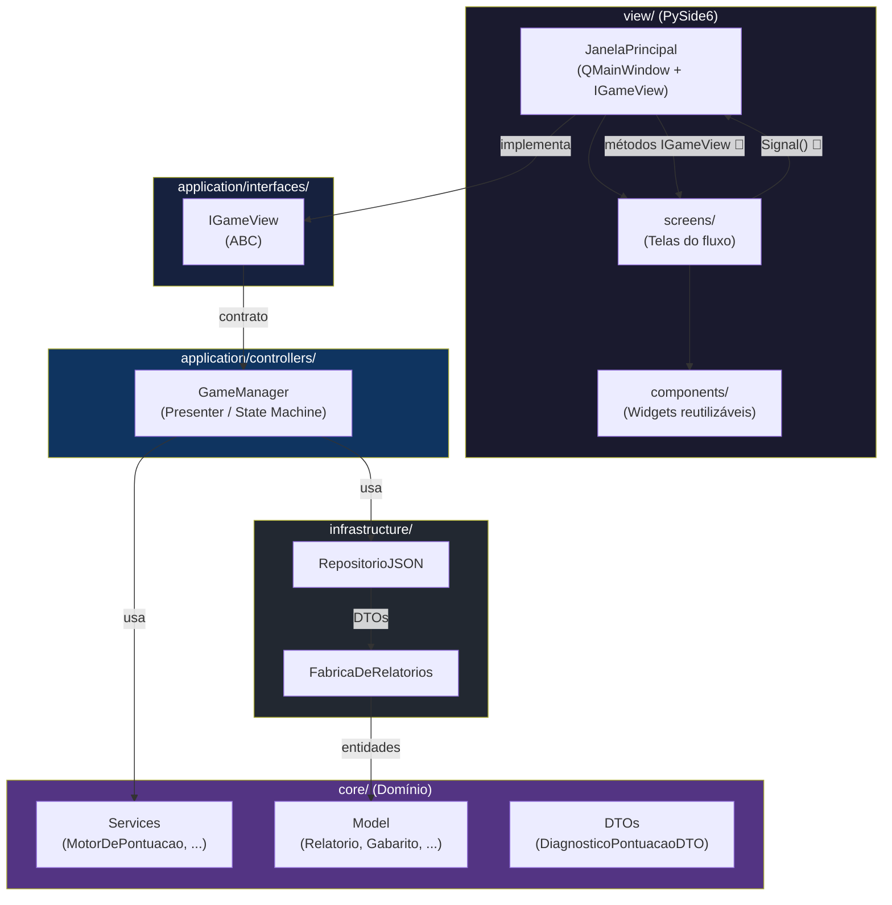

# Padrões de Arquitetura da Camada View (PySide6 + MVP)

**Projeto:** Inspetor IFF BJI

**Módulo:** Camada de Apresentação (View)

**Tecnologia:** PySide6 (Qt for Python)

---

## 1. Introdução

Este documento estabelece as diretrizes arquiteturais para o desenvolvimento de interfaces gráficas (UI) no projeto **Inspetor IFF BJI**. A nossa aplicação segue o padrão **Model-View-Presenter (MVP)** conjugado com os princípios da **Arquitetura Limpa (Clean Architecture)**.

O objetivo principal desta camada é ser uma **View Passiva (Dumb View)**: a interface não toma decisões de negócio, não calcula pontuações e não conhece as regras do domínio. Ela apenas exibe os dados que lhe são entregues e reporta as interações do utilizador (cliques) ao `GameManager`.

---

## 2. Diagrama de Arquitetura de Camadas

O fluxo de dados entre as camadas segue o princípio da dependência invertida: a View depende do Presenter (GameManager) através de um contrato (`IGameView`), e o Presenter depende dos Serviços de Domínio e Infraestrutura.



### Legenda do Fluxo

| Sentido | Descrição |
|---------|-----------|
| 🔼 Signal (Bottom-Up) | A tela emite um Signal → MainWindow → GameManager |
| 🔽 Método IGameView (Top-Down) | GameManager chama método contrato → MainWindow troca tela |
| `implementa` | JanelaPrincipal assina o ABC IGameView |
| `usa` | GameManager consome serviços de domínio e repositórios |

---

## 3. O Contrato de Interface (`IGameView`)

Para garantir o princípio da **Inversão de Dependência** (o "D" do SOLID), o *Back-end* (o `GameManager`) nunca importa componentes do PySide6. A comunicação é feita estritamente através de um contrato abstrato: a classe `IGameView`.

* **Regra 1:** Apenas a janela principal (`MainWindow`) assina e implementa o `IGameView`.
* **Regra 2:** Se um novo ecrã for adicionado ao fluxo do jogo, o método de transição deve ser declarado primeiro no `IGameView` (ex: `exibir_nova_tela()`).
* **Regra 3:** O `GameManager` aciona a UI chamando os métodos do contrato, e a UI responde alterando o índice do `QStackedWidget`.

---

## 4. Separação Estrita: Estrutura vs. Estilo

Inspirados no desenvolvimento Web moderno (HTML + CSS), o nosso projeto proíbe terminantemente a mistura de estrutura lógica e estilo visual no mesmo ficheiro.

### 4.1. Estrutura (O "HTML"): Código Python

Os ficheiros `.py` dentro da pasta `view/` são responsáveis **exclusivamente** por:

* Instanciar os widgets (`QPushButton`, `QLabel`, `QVBoxLayout`).
* Definir a hierarquia (quem é filho de quem).
* Atribuir identificadores (`ObjectName`) e classes dinâmicas (`Property("class")`).
* Ligar eventos de clique aos `Signals`.

**O que é proibido no Python:** Usar o método `.setStyleSheet()` para definir cores, fontes ou margens internas (com exceção de manipulações de imagens dinâmicas que o exijam, como o *wallpaper*).

### 4.2. Estilo (O "CSS"): Ficheiros `.qss`

Toda a estética da aplicação vive na pasta `assets/style.qss`. Este ficheiro global é injetado no arranque da aplicação e estiliza os componentes com base nos seus identificadores e propriedades de classe.

### Exemplo do Padrão Exigido:

**✅ CORRETO (No Python - view/screens/tela_menu.py):**

```python
self.btn_iniciar = QPushButton("INICIAR EXPEDIENTE")
self.btn_iniciar.setObjectName("btn_iniciar")          # ID Único
self.btn_iniciar.setProperty("class", "btn_primario")  # Classe genérica
self.layout.addWidget(self.btn_iniciar)
```

**✅ CORRETO (No QSS - assets/style.qss):**

```css
/* Estilizando pela classe */
.btn_primario {
    background-color: #2F9E41;
    color: #FDE2CF;
    border-radius: 8px;
}

/* Estilizando pelo ID (Pseudo-estados) */
#btn_iniciar:hover {
    background-color: #37a547;
}
```

**❌ INCORRETO (Anti-Pattern):**

```python
# Proibido: Misturar estilo no ficheiro Python
self.btn_iniciar.setStyleSheet("background-color: #2F9E41; color: white;")
```

---

## 5. Estrutura de Diretórios da View

A pasta `view/` está organizada de forma a maximizar a reutilização e o isolamento de componentes:

```text
view/
├── components/          # Widgets reutilizáveis (Botões, Modais, Barra de Tarefas)
│                        # -> Não emitem Signals globais, recebem dados via construtor.
├── screens/             # Telas de fluxo (Menu, Inspeção, Diagnóstico)
│                        # -> Herdam de QWidget. Emitem Signals para a MainWindow.
├── assets/              # Ficheiros estáticos (.qss, imagens, fontes)
└── main_window.py       # Orquestrador Visual. Implementa IGameView e QStackedWidget.
```

---

## 6. Comunicação Baseada em Eventos (Signals e Slots)

Como as telas (Screens) não conhecem o `GameManager`, a comunicação flui de "baixo para cima" (Bottom-Up) utilizando os `Signals` do Qt.

1. **Ação do Utilizador:** O jogador clica no botão "Confirmar Perfil".
2. **A Tela (Screen) retransmite:** A classe `ViewSelecaoPerfil` lê a `QComboBox` e emite um sinal limpo: `self.sinal_perfil_confirmado.emit("T_MEIO_AMBIENTE")`.
3. **A MainWindow orquestra:** A `MainWindow` capturou esse sinal na inicialização e repassou-o para o `GameManager` (o Presenter).
4. **O Presenter age:** O `GameManager` processa a string no domínio puro, sem saber se a string veio de um PySide6 ou de um terminal.

Este fluxo garante que podemos testar as regras do jogo sem renderizar uma única janela, e podemos redesenhar toda a interface sem alterar uma única linha das regras de negócio.

---

*Fim do Documento*
