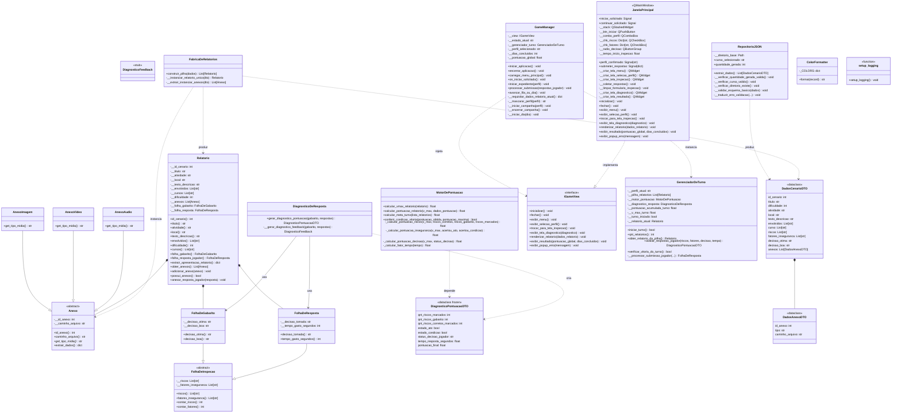

# Diagrama de Classes

```mermaid
classDiagram
    %% ==================== Core Model Layer ====================
    class Anexo {
        <<abstract>>
        -__id_anexo: int
        -__caminho_arquivo: str
        +id_anexo() int
        +caminho_arquivo() str
        +get_tipo_midia()* str
        +extrair_dados() dict
    }
    class AnexoImagem {
        +get_tipo_midia() str
    }
    class AnexoVideo {
        +get_tipo_midia() str
    }
    class AnexoAudio {
        +get_tipo_midia() str
    }
    class FolhaDeInspecao {
        <<abstract>>
        -__riscos: List[str]
        -__fatores_inseguranca: List[str]
        +riscos() List[str]
        +fatores_inseguranca() List[str]
        +contar_riscos() int
        +contar_fatores() int
    }
    class FolhaDeGabarito {
        -__decisao_otima: str
        -__decisao_boa: str
        +decisao_otima() str
        +decisao_boa() str
    }
    class FolhaDeResposta {
        -__decisao_tomada: str
        -__tempo_gasto_segundos: int
        +decisao_tomada() str
        +tempo_gasto_segundos() int
    }
    class Relatorio {
        -__id_cenario: int
        -__titulo: str
        -__atividade: str
        -__local: str
        -__texto_descricao: str
        -__envolvidos: List[str]
        -__cursos: List[str]
        -__dificuldade: int
        -__anexos: List[Anexo]
        -__folha_gabarito: FolhaDeGabarito
        -__folha_resposta: FolhaDeResposta
        +id_cenario() int
        +titulo() str
        +atividade() str
        +local() str
        +texto_descricao() str
        +envolvidos() List[str]
        +dificuldade() int
        +cursos() List[str]
        +folha_gabarito() FolhaDeGabarito
        +folha_resposta_jogador() FolhaDeResposta
        +extrair_apresentacao_relatorio() dict
        +obter_anexos() List[Anexo]
        +adicionar_anexo(anexo) void
        +possui_anexos() bool
        +anexar_resposta_jogador(resposta) void
    }
    AnexoImagem --|> Anexo
    AnexoVideo --|> Anexo
    AnexoAudio --|> Anexo
    FolhaDeGabarito --|> FolhaDeInspecao
    FolhaDeResposta --|> FolhaDeInspecao
    Relatorio *-- Anexo
    Relatorio *-- FolhaDeGabarito
    Relatorio *-- FolhaDeResposta

    %% ==================== Core Services Layer ====================
    class MotorDePontuacao {
        +calcular_vmax_relatorio(relatorio) float
        +calcular_pontuacao_relatorio(v_max, dados_pontuacao) float
        +calcular_meta_turno(lista_relatorios) float
        +conferir_condicao_vitoria(pontuacao_obtida, pontuacao_maxima) bool
        -_calcular_pontuacao_riscos(v_max, riscos_corretos, riscos_gabarito, riscos_marcados) float
        -_calcular_pontuacao_inseguranca(v_max, acertou_ato, acertou_condicao) float
        -_calcular_pontuacao_decisao(v_max, status_decisao) float
        -_calcular_fator_tempo(tempo) float
    }
    class DiagnosticoDeResposta {
        +gerar_diagnostico_pontuacao(gabarito, respostas) DiagnosticoPontuacaoDTO
        -__gerar_diagnostico_feedback(gabarito, respostas) DiagnosticoFeedback
    }
    class DiagnosticoFeedback {
        <<stub>>
    }
    MotorDePontuacao ..> DiagnosticoPontuacaoDTO : depende
    DiagnosticoDeResposta ..> DiagnosticoPontuacaoDTO : cria
    DiagnosticoDeResposta --> FolhaDeGabarito : usa
    DiagnosticoDeResposta --> FolhaDeResposta : usa

    %% ==================== Core DTOs ====================
    class DiagnosticoPontuacaoDTO {
        <<dataclass frozen>>
        qnt_riscos_marcados: int
        qnt_riscos_gabarito: int
        qnt_riscos_corretos_marcados: int
        estado_ato: bool
        estado_condicao: bool
        status_decisao_jogador: str
        tempo_resposta_segundos: float
        pontuacao_final: float
    }

    %% ==================== Infrastructure Layer ====================
    class RepositorioJSON {
        -__diretorio_base: Path
        +curso_selecionado: str
        +quantidade_gerada: int
        +extrair_dados() List[DadosCenarioDTO]
        -__verificar_quantidade_gerada_valida() void
        -__verificar_curso_valido() void
        -__verificar_diretorio_existe() void
        -__validar_esquema_basico(dados) void
        -__traduzir_erro_validacao(...) void
    }
    class FabricaDeRelatorios {
        +construir_pilha(dados) List[Relatorio]
        -__instanciar_relatorio_unico(dto) Relatorio
        -__extrair_instanciar_anexos(dto) List[Anexo]
    }
    class DadosCenarioDTO {
        <<dataclass>>
        id_cenario: int
        titulo: str
        dificuldade: int
        atividade: str
        local: str
        texto_descricao: str
        envolvidos: List[str]
        curso: List[str]
        riscos: List[str]
        fatores_inseguranca: List[str]
        decisao_otima: str
        decisao_boa: str
        anexos: List[DadosAnexoDTO]
    }
    class DadosAnexoDTO {
        <<dataclass>>
        id_anexo: int
        tipo: str
        caminho_arquivo: str
    }
    DadosCenarioDTO *-- DadosAnexoDTO
    RepositorioJSON ..> DadosCenarioDTO : produz
    FabricaDeRelatorios ..> DadosCenarioDTO : consome
    FabricaDeRelatorios ..> Relatorio : produz
    FabricaDeRelatorios ..> Anexo : instancia

    %% ==================== Application Layer ====================
    class IGameView {
        <<interface>>
        +inicializar() void
        +fechar() void
        +exibir_menu() void
        +exibir_selecao_perfil() void
        +trocar_para_tela_inspecao() void
        +exibir_tela_diagnostico(diagnostico) void
        +renderizar_relatorio(dados_relatorio) void
        +exibir_resultado(pontuacao_global, dias_concluidos) void
        +exibir_popup_erro(mensagem) void
    }
    class GerenciadorDeTurno {
        -__perfil_atual: str
        -__pilha_relatorios: List[Relatorio]
        -__motor_pontuacao: MotorDePontuacao
        -__diagnostico_resposta: DiagnosticoDeResposta
        -__pontuacao_acumulada_turno: float
        -__v_max_turno: float
        -__turno_iniciado: bool
        -__relatorio_atual: Relatorio
        +iniciar_turno() bool
        +qnt_relatorios() int
        +obter_relatorio_da_pilha() Relatorio
        +avaliar_respostas_jogador(riscos, fatores, decisao, tempo) DiagnosticoPontuacaoDTO
        +verificar_vitoria_do_turno() bool
        -__processar_submissao_jogador(...) FolhaDeResposta
    }
    class GameManager {
        -__view: IGameView
        -__estado_atual: str
        -__gerenciador_turno: GerenciadorDeTurno
        -__perfil_selecionado: str
        -__dias_concluidos: int
        -__pontuacao_global: float
        +iniciar_aplicacao() void
        +encerrar_aplicacao() void
        +carregar_menu_principal() void
        +on_iniciar_solicitado() void
        +iniciar_expediente(perfil) void
        +processar_submissao(respostas_jogador) void
        +avancar_fila_ou_dia() void
        -__requisitar_dados_relatorio_atual() dict
        -__mascarar_perfil(perfil) str
        -__iniciar_campanha(perfil) void
        -__encerrar_campanha() void
        -__iniciar_dia(dia) void
    }
    GameManager ..> IGameView : injeta
    GameManager ..> GerenciadorDeTurno : instancia

    %% ==================== View Layer ====================
    class JanelaPrincipal {
        <<QMainWindow>>
        <<IGameView>>
        +iniciar_solicitado: Signal
        +perfil_confirmado: Signal(str)
        +submeter_respostas: Signal(dict)
        +continuar_solicitado: Signal
        -__stack: QStackedWidget
        -__btn_iniciar: QPushButton
        -__combo_perfil: QComboBox
        -__chk_riscos: Dict[str, QCheckBox]
        -__chk_fatores: Dict[str, QCheckBox]
        -__radio_decisao: QButtonGroup
        -__tempo_inicio_inspecao: float
        -__criar_tela_menu() QWidget
        -__criar_tela_selecao_perfil() QWidget
        -__criar_tela_inspecao() QWidget
        -__coletar_respostas() void
        -__limpar_formulario_inspecao() void
        -__criar_tela_diagnostico() QWidget
        -__criar_tela_resultado() QWidget
        +inicializar() void
        +fechar() void
        +exibir_menu() void
        +exibir_selecao_perfil() void
        +trocar_para_tela_inspecao() void
        +exibir_tela_diagnostico(diagnostico) void
        +renderizar_relatorio(dados_relatorio) void
        +exibir_resultado(pontuacao_global, dias_concluidos) void
        +exibir_popup_erro(mensagem) void
    }
    JanelaPrincipal ..|> IGameView : implementa

    %% ==================== Config ====================
    class ColorFormatter {
        -_COLORS: dict
        +format(record) str
    }
    class setup_logging {
        <<function>>
        +setup_logging() void
    }
```
