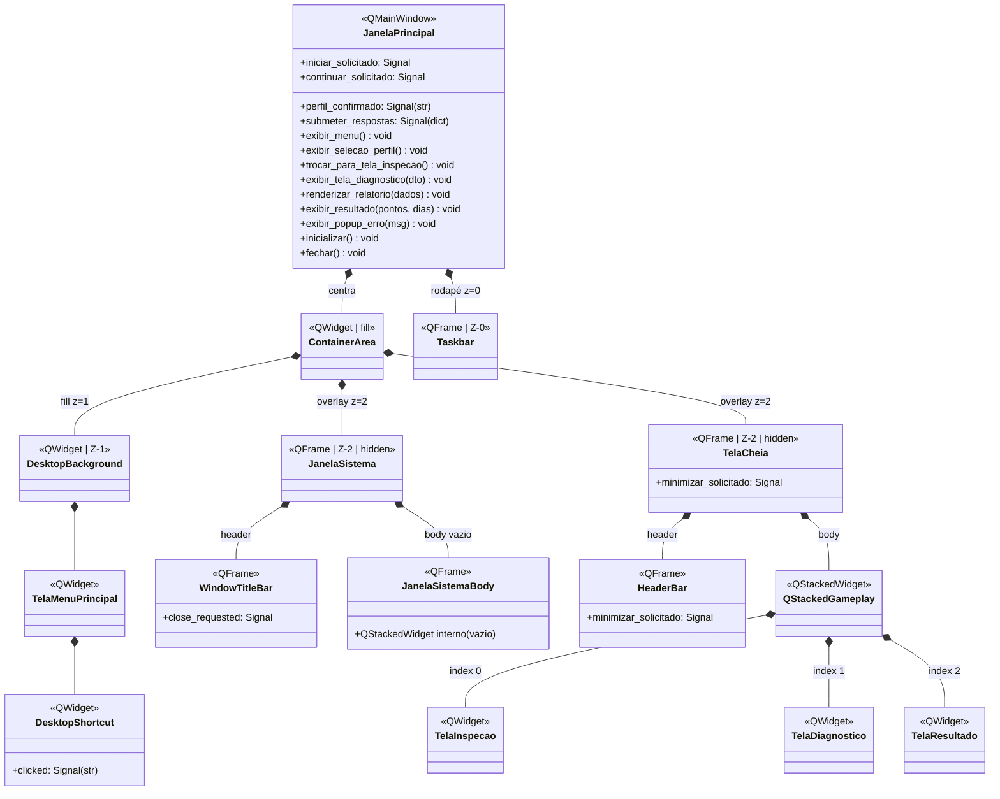
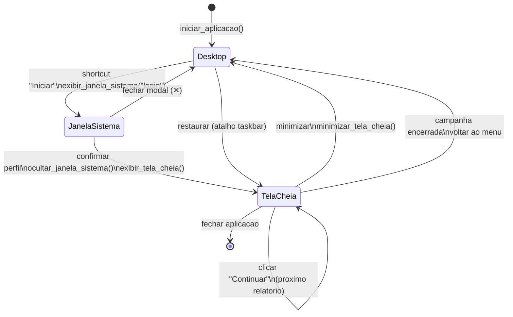

# Diagrama de Overlays e Z-Order

## 1. Diagrama Z-Order (ASCII)

```
z=0 (fundo) ─────────────────────────────────────────────────────
  Taskbar (altura fixa ~40px, rodapé)
  ┌──────────────────────────────────────────────────────────┐
  │ [Iniciar]                    [🔍 Inspeção Ativa]  14:30  │
  └──────────────────────────────────────────────────────────┘

z=1 ───────────────────────────────────────────────────────────
  DesktopBackground (wallpaper, fill parent)
  ┌──────────────────────────────────────────────────────────┐
  │                                                          │
  │  ┌──────┐ ┌──────┐ ┌──────┐                             │
  │  │ 🖥️   │ │ 📁   │ │ ❓   │                             │
  │  │Iniciar│ │Relat.│ │Ajuda │                             │
  │  │Exped. │ │Pend. │ │      │                             │
  │  └──────┘ └──────┘ └──────┘                             │
  │                               ┌──────────┐               │
  │                               │ Logo IFF │               │
  │                               └──────────┘               │
  └──────────────────────────────────────────────────────────┘

z=2 (overlays, ocultos por padrão) ────────────────────────────
  ┌── JanelaSistema (centralizada, ~75%) ────────────────────┐
  │  ┌────────────────────────────────────────────────┐      │
  │  │ WindowTitleBar [título]                [✕]     │      │
  │  ├────────────────────────────────────────────────┤      │
  │  │ JanelaSistemaBody (QStackedWidget, vazio)      │      │
  │  └────────────────────────────────────────────────┘      │
  └───────────────────────────────────────────────────────────┘

  ┌── TelaCheia (~95% viewport) ─────────────────────────────┐
  │  ┌────────────────────────────────────────────────┐      │
  │  │ HeaderBar [título relatório]       [— minimizar]│      │
  │  ├────────────────────────────────────────────────┤      │
  │  │ QStackedWidget (conteúdo interno)              │      │
  │  │   [0] Inspeção (formulário + relatório)        │      │
  │  │   [1] Diagnóstico (feedback)                   │      │
  │  │   [2] Resultado (pontuação final)              │      │
  │  └────────────────────────────────────────────────┘      │
  └───────────────────────────────────────────────────────────┘
```

---

## 2. Diagrama de Classes (Composição)



### Legenda

| Símbolo | Relação | Exemplo |
|---------|---------|---------|
| `*--` (losango preenchido) | Composição (contém, é dono) | `JanelaPrincipal *-- ContainerArea` |
| `Z-N` | Camada de sobreposição visual | `Z-0` = fundo, `Z-2` = topo |
| `hidden` | Overlay oculto por padrão (só aparece sob demanda) | `JanelaSistema`, `TelaCheia` |

---

## 3. Diagrama de Estados (Navegação)



### Transições

| Estado de Origem | Ação | Estado de Destino | Método IGameView |
|------------------|------|------------------|------------------|
| `[*]` (inicial) | `iniciar_aplicacao()` | `Desktop` | `inicializar()` |
| `Desktop` | Clicou shortcut "Iniciar" | `JanelaSistema` | — (signal direto) |
| `JanelaSistema` | Fechou (✕) | `Desktop` | — (hide interno) |
| `JanelaSistema` | Confirmou perfil | `TelaCheia` | `trocar_para_tela_inspecao()` |
| `TelaCheia` | Submeteu respostas | `TelaCheia` (diagnóstico) | `exibir_tela_diagnostico(dto)` |
| `TelaCheia` | Clicou "Continuar" | `TelaCheia` (próx. relatório) | `renderizar_relatorio(dados)` |
| `TelaCheia` | Clicou "Continuar" (fim) | `TelaCheia` (resultado) | `exibir_resultado(pontos, dias)` |
| `TelaCheia` | Clicou minimizar | `Desktop` | — (hide interno) |
| `Desktop` | Restaurar (atalho taskbar) | `TelaCheia` | — (show interno) |
| `TelaCheia` | Campanha encerrada | `Desktop` | `exibir_menu()` |

---

## 4. Hierarquia de Widgets (resumo)

```
JanelaPrincipal (QMainWindow)
└── centralWidget: QWidget (QVBoxLayout, spacing=0)
    ├── ContainerArea (QWidget, stretch=1)
    │   ├── DesktopBackground (QLabel, lower(), fill parent)        [z=1]
    │   │   └── TelaMenuPrincipal (QWidget)
    │   │       ├── Wallpaper (QLabel, fill)
    │   │       ├── DesktopShortcut (vários, grid)
    │   │       └── Logo IFF (QLabel, bottom-right)
    │   ├── JanelaSistema (QFrame, centralizado, hide())            [z=2]
    │   │   ├── WindowTitleBar (QFrame, header)
    │   │   └── JanelaSistemaBody (QFrame, body)
    │   │       └── QStackedWidget (vazio)
    │   └── TelaCheia (QFrame, ~95%, hide())                        [z=2]
    │       ├── HeaderBar (QFrame, header)
    │       │   ├── QLabel (título)
    │       │   └── QPushButton (minimizar)
    │       └── QStackedWidget (conteúdo gameplay)
    │           ├── [0] TelaInspecao (formulário)
    │           ├── [1] TelaDiagnostico (feedback)
    │           └── [2] TelaResultado (pontuação)
    └── Taskbar (QFrame, altura fixa ~40px)                        [z=0]
```

---

## 5. Regras de Z-Order

1. **Taskbar (z=0):** Sempre visível no rodapé. Não é coberta por nenhum overlay.
2. **DesktopBackground (z=1):** Preenche todo o espaço entre a taskbar e o topo. Contém wallpaper e elementos interativos (shortcuts, logo).
3. **JanelaSistema (z=2):** Sobreposto ao desktop, centralizado. Usado para modais de login, seleção, loading. Inicia oculto.
4. **TelaCheia (z=2):** Sobreposto ao desktop, ~95% do viewport com margem. Usado para gameplay (inspeção, diagnóstico, resultado). Inicia oculto.
5. Overlays no mesmo Z (2) não coexistem visíveis ao mesmo tempo — apenas um é mostrado por vez.
