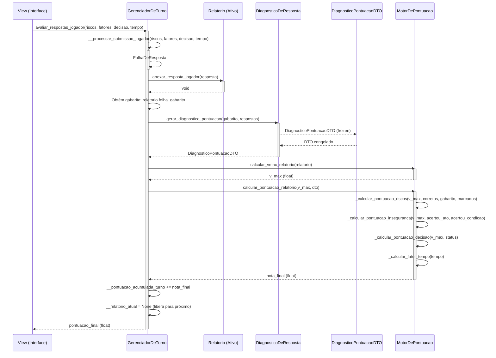
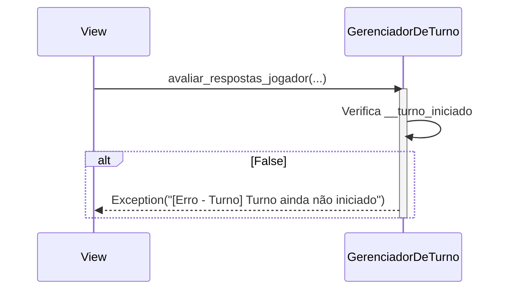
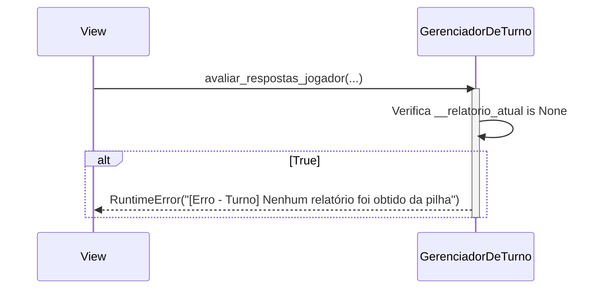
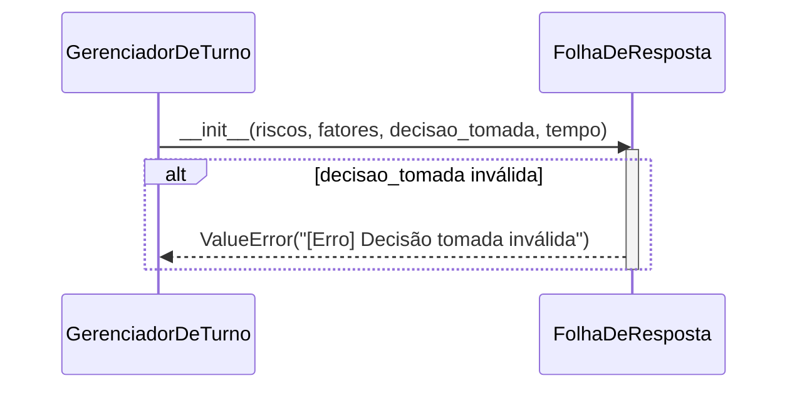
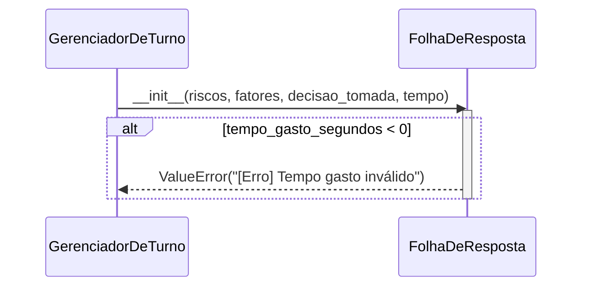

# Avaliação (Core Gameplay) — Diagrama de sequência

---

## 1. Pré-condições e pós-condições

### Pré-condições

- [ ] Turno iniciado com sucesso
- [ ] `__relatorio_atual` contém um `Relatorio` obtido via `obter_relatorio_da_pilha()`
- [ ] O relatório ativo possui `FolhaDeGabarito` válida

### Pós-condições

- [ ] `__relatorio_atual = None` (libera o ciclo para o próximo relatório)
- [ ] `__pontuacao_acumulada_turno` acrescida da nota do relatório avaliado
- [ ] `FolhaDeResposta` anexada permanentemente ao relatório
- [ ] Nota final do relatório retornada à UI

---

## 2. Diagrama de sequência

### Fluxo principal (caminho feliz)

---

## 3. Fluxos de erro

### Tabela de referência rápida

| ID | Cenário | Condição de disparo | Resposta ao usuário |
|----|---------|---------------------|---------------------|
| E1 | Turno não iniciado | `avaliar_respostas_jogador()` sem turno ativo | `Exception("[Erro - Turno] Turno ainda não iniciado")` |
| E2 | Sem relatório ativo | `avaliar_respostas_jogador()` sem `__relatorio_atual` | `RuntimeError("[Erro - Turno] Nenhum relatório foi obtido da pilha")` |
| E3 | Decisão inválida | Valor de `decisao` fora de `["INTERDITAR", "ADVERTIR", "IGNORAR"]` | `ValueError("[Erro] Decisão tomada inválida")` |
| E4 | Tempo negativo | `tempo_segundos < 0` | `ValueError("[Erro] Tempo gasto inválido")` |
| E5 | Risco inválido | Tipo de risco fora de `LISTA_RISCOS_VALIDOS` | `ValueError("[Erro] Riscos inválidos encontrados")` |
| E6 | Fator inválido | Fator fora de `FATORES_INSEGURANCA_VALIDOS` | `ValueError("[Erro] Fatores de insegurança inválidos encontrados")` |

---

### E1 — Turno não iniciado

**Condição:** `avaliar_respostas_jogador()` é chamado com `__turno_iniciado == False`.

**Decisão:** mesma guarda do laço de jogo — a flag de turno protege todo o ciclo de vida.

---

### E2 — Sem relatório ativo

**Condição:** `avaliar_respostas_jogador()` é chamado sem que um relatório tenha sido obtido da pilha.

**Decisão:** impede que o sistema avalie sem um relatório em mãos; o jogador deve chamar `obter_relatorio_da_pilha()` primeiro.

---

### E3 — Decisão inválida

**Condição:** o campo `decisao` não está entre `"INTERDITAR"`, `"ADVERTIR"` ou `"IGNORAR"`.

**Decisão:** validação no construtor da entidade de domínio — a FolhaDeResposta não pode existir em estado inconsistente.

---

### E4 — Tempo negativo

**Condição:** `tempo_segundos < 0`.

**Decisão:** tempo físico não pode ser negativo; o front-end deve garantir um cronômetro que nunca dispare valores negativos.
