# Orquestração da TelaDeExpediente — Diagramas de sequência

> **Data:** 2026-07-06
> **Versão:** 1.0 (pós-refatoração — 5 classes `Pagina*` extraídas)

---

## 1. Arquitectura do Orquestrador

```
GameManager (Presenter)
    │
    ▼
JanelaPrincipal / main_window.py  (implementa IGameView)
    │
    ▼
TelaDeExpediente (orquestrador QFrame)
    │
    ├── WindowTitleBar (gestão de janela)
    ├── Sidebar (visibilidade condicional)
    ├── QStackedWidget
    │     ├── [0] PaginaSelecaoPerfil
    │     ├── [1] PaginaLoading
    │     ├── [2] PaginaInspecao  ← detém AnexoPreview, AnexoGallery†, MediaViewer†
    │     ├── [3] PaginaDiagnostico
    │     └── [4] PaginaEndgame
    │
    └── AnexoGallery† (overlay z-order, filho directo)
        MediaViewer† (overlay z-order, filho directo)

    †: instanciados em TelaDeExpediente (para z-order), geridos por PaginaInspecao
```

**Princípio:** o orquestrador nunca acede a widgets internos das páginas. Toda a comunicação é via:
- Signals (das páginas para o orquestrador → relay)
- Métodos públicos (do orquestrador para as páginas)

---

## 2. Pré-condições e pós-condições globais

### Pré-condições

- [ ] `QApplication` e `setup_logging()` inicializados
- [ ] `JanelaPrincipal` instanciada e visível
- [ ] `GameManager` instanciado com `janela` como `IGameView`
- [ ] `TelaDeExpediente` construída e populada no `QStackedWidget` da `JanelaPrincipal`

### Pós-condições (após qualquer fluxo)

- [ ] `TelaDeExpediente` sempre num dos 5 estados (índice 0-4)
- [ ] Overlays (`AnexoGallery`, `MediaViewer`) sempre ocultos a menos que explicitamente abertos
- [ ] Nenhuma excepção não tratada vaza da View

---

## 3. Diagramas de sequência

---

### 3.1 Setup inicial

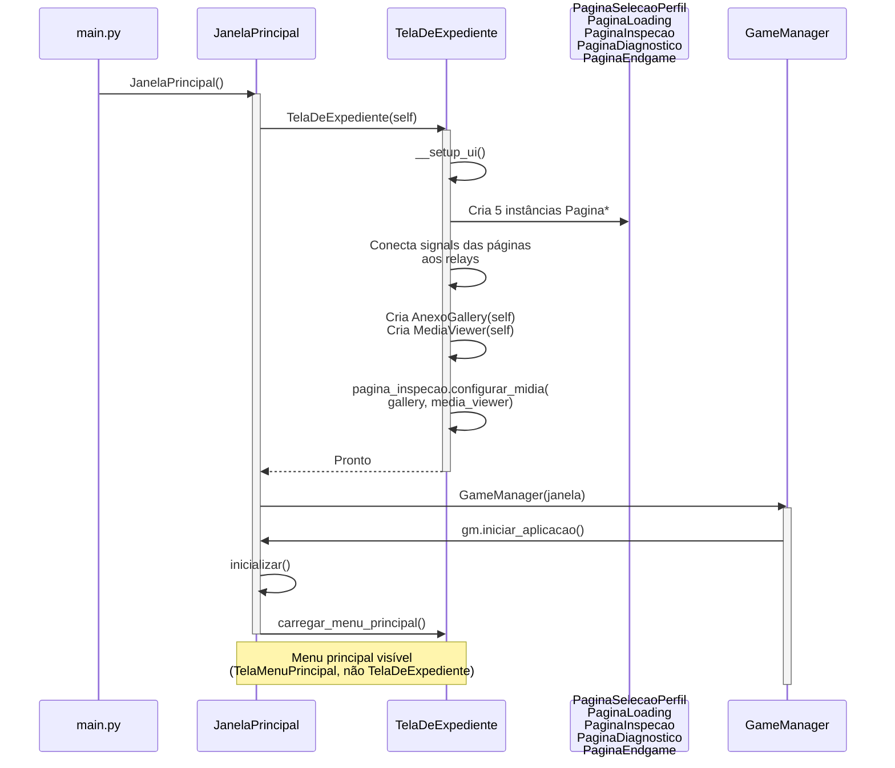
```mermaid
sequenceDiagram
    participant Main as main.py
    participant JP as JanelaPrincipal
    participant TE as TelaDeExpediente
    participant P* as PaginaSelecaoPerfil<br/>PaginaLoading<br/>PaginaInspecao<br/>PaginaDiagnostico<br/>PaginaEndgame
    participant GM as GameManager

    Main->>JP: JanelaPrincipal()
    activate JP
    JP->>TE: TelaDeExpediente(self)
    activate TE
    TE->>TE: __setup_ui()
    TE->>P*: Cria 5 instâncias Pagina*
    TE->>TE: Conecta signals das páginas<br/>aos relays
    TE->>TE: Cria AnexoGallery(self)<br/>Cria MediaViewer(self)
    TE->>TE: pagina_inspecao.configurar_midia(<br/>  gallery, media_viewer)
    TE-->>JP: Pronto
    deactivate TE
    JP->>GM: GameManager(janela)
    activate GM
    GM->>JP: gm.iniciar_aplicacao()
    JP->>JP: inicializar()
    JP->>TE: carregar_menu_principal()
    deactivate JP
    Note over JP,TE: Menu principal visível<br/>(TelaMenuPrincipal, não TelaDeExpediente)
    deactivate GM
```

---

### 3.2 Seleção de Perfil

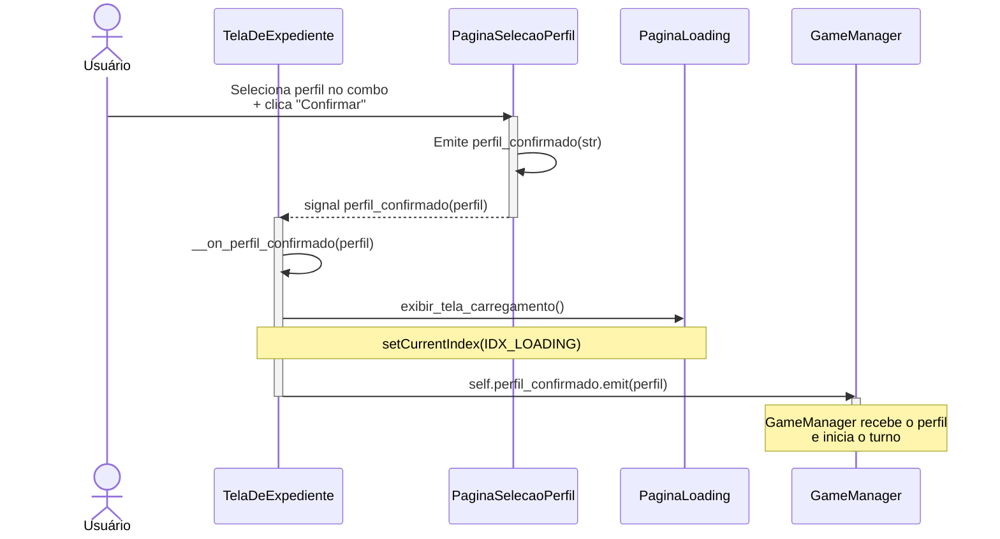
```mermaid
sequenceDiagram
    actor User as Usuário
    participant TE as TelaDeExpediente
    participant PP as PaginaSelecaoPerfil
    participant PL as PaginaLoading
    participant GM as GameManager

    User->>PP: Seleciona perfil no combo<br/>+ clica "Confirmar"
    activate PP
    PP->>PP: Emite perfil_confirmado(str)
    PP-->>TE: signal perfil_confirmado(perfil)
    deactivate PP
    activate TE
    TE->>TE: __on_perfil_confirmado(perfil)
    TE->>PL: exibir_tela_carregamento()
    Note over TE,PL: setCurrentIndex(IDX_LOADING)
    TE->>GM: self.perfil_confirmado.emit(perfil)
    deactivate TE
    activate GM
    Note over GM: GameManager recebe o perfil<br/>e inicia o turno
    deactivate GM
```

---

### 3.3 Renderização de Relatório (início da inspecção)

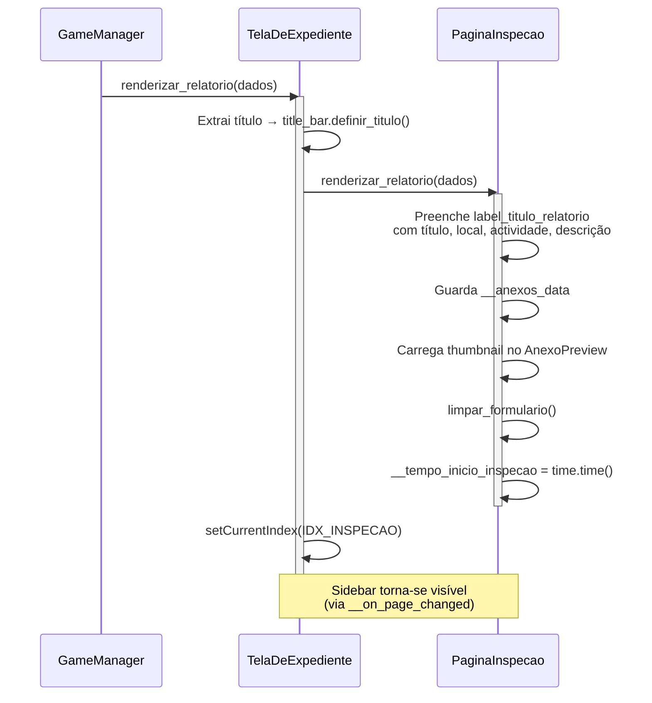
```mermaid
sequenceDiagram
    participant GM as GameManager
    participant TE as TelaDeExpediente
    participant PI as PaginaInspecao

    GM->>TE: renderizar_relatorio(dados)
    activate TE
    TE->>TE: Extrai título → title_bar.definir_titulo()
    TE->>PI: renderizar_relatorio(dados)
    activate PI
    PI->>PI: Preenche label_titulo_relatorio<br/>com título, local, actividade, descrição
    PI->>PI: Guarda __anexos_data
    PI->>PI: Carrega thumbnail no AnexoPreview
    PI->>PI: limpar_formulario()
    PI->>PI: __tempo_inicio_inspecao = time.time()
    deactivate PI
    TE->>TE: setCurrentIndex(IDX_INSPECAO)
    Note over TE,PI: Sidebar torna-se visível<br/>(via __on_page_changed)
    deactivate TE
```

---

### 3.4 Submissão de Respostas

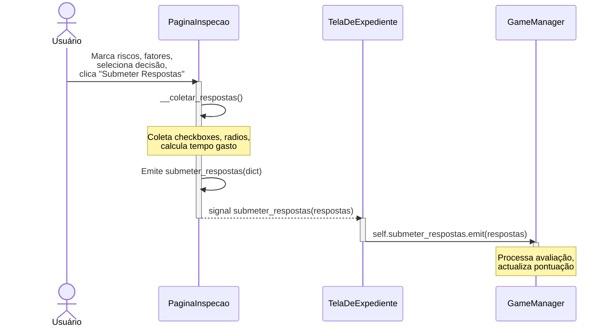
```mermaid
sequenceDiagram
    actor User as Usuário
    participant PI as PaginaInspecao
    participant TE as TelaDeExpediente
    participant GM as GameManager

    User->>PI: Marca riscos, fatores,<br/>seleciona decisão,<br/>clica "Submeter Respostas"
    activate PI
    PI->>PI: __coletar_respostas()
    Note over PI: Coleta checkboxes, radios,<br/>calcula tempo gasto
    PI->>PI: Emite submeter_respostas(dict)
    PI-->>TE: signal submeter_respostas(respostas)
    deactivate PI
    activate TE
    TE->>GM: self.submeter_respostas.emit(respostas)
    deactivate TE
    activate GM
    Note over GM: Processa avaliação,<br/>actualiza pontuação
    deactivate GM
```

---

### 3.5 Visualização de Anexos (Gallery)

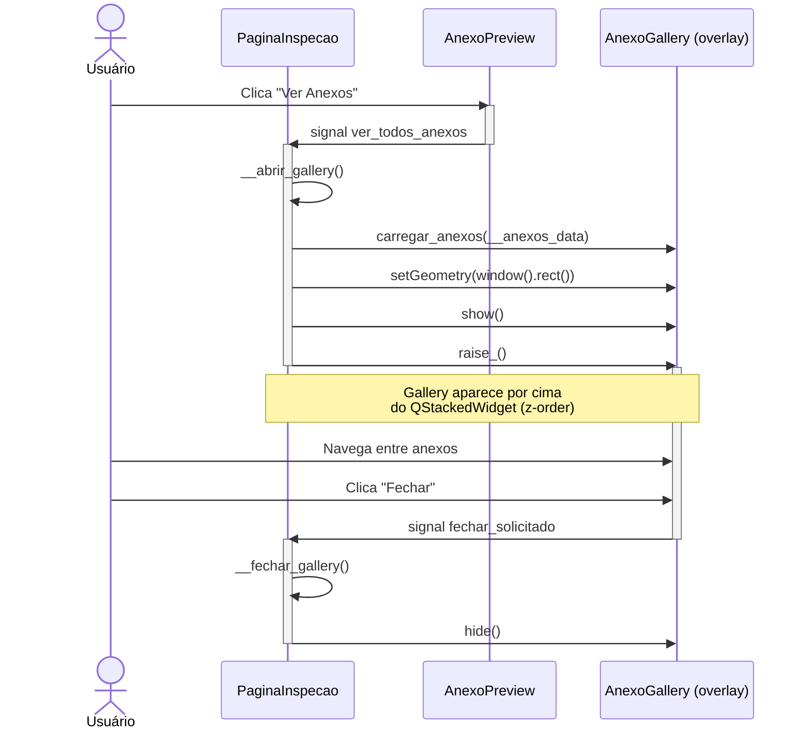
```mermaid
sequenceDiagram
    actor User as Usuário
    participant PI as PaginaInspecao
    participant Preview as AnexoPreview
    participant Gallery as AnexoGallery (overlay)

    User->>Preview: Clica "Ver Anexos"
    activate Preview
    Preview->>PI: signal ver_todos_anexos
    deactivate Preview
    activate PI
    PI->>PI: __abrir_gallery()
    PI->>Gallery: carregar_anexos(__anexos_data)
    PI->>Gallery: setGeometry(window().rect())
    PI->>Gallery: show()
    PI->>Gallery: raise_()
    deactivate PI
    activate Gallery
    Note over Gallery,PI: Gallery aparece por cima<br/>do QStackedWidget (z-order)
    User->>Gallery: Navega entre anexos
    User->>Gallery: Clica "Fechar"
    Gallery->>PI: signal fechar_solicitado
    deactivate Gallery
    activate PI
    PI->>PI: __fechar_gallery()
    PI->>Gallery: hide()
    deactivate PI
```

---

### 3.6 Ampliação de Mídia (MediaViewer)

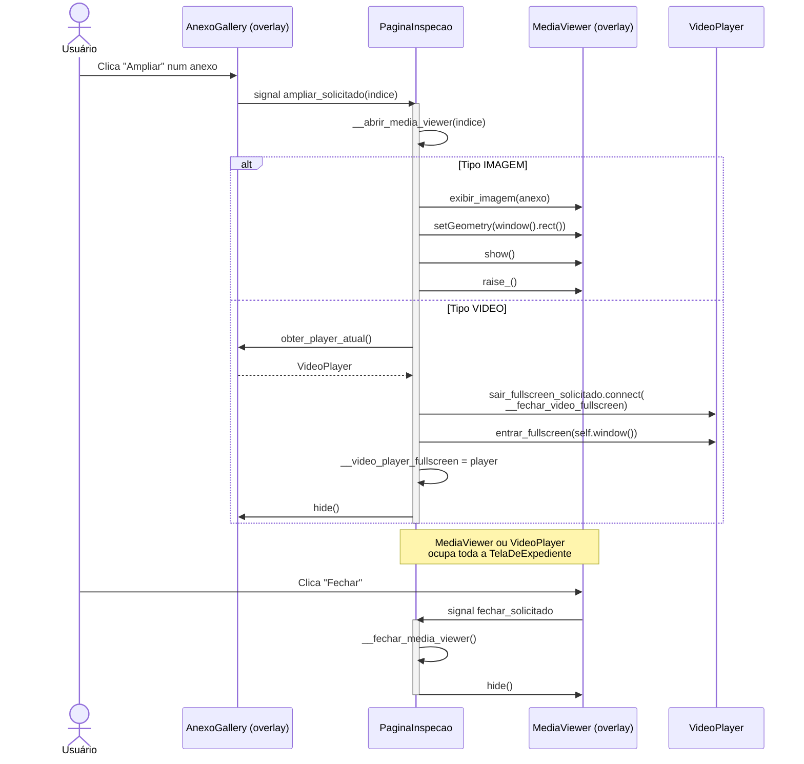
```mermaid
sequenceDiagram
    actor User as Usuário
    participant Gallery as AnexoGallery (overlay)
    participant PI as PaginaInspecao
    participant MV as MediaViewer (overlay)
    participant VP as VideoPlayer

    User->>Gallery: Clica "Ampliar" num anexo
    Gallery->>PI: signal ampliar_solicitado(indice)
    activate PI
    PI->>PI: __abrir_media_viewer(indice)
    alt Tipo IMAGEM
        PI->>MV: exibir_imagem(anexo)
        PI->>MV: setGeometry(window().rect())
        PI->>MV: show()
        PI->>MV: raise_()
    else Tipo VIDEO
        PI->>Gallery: obter_player_atual()
        Gallery-->>PI: VideoPlayer
        PI->>VP: sair_fullscreen_solicitado.connect(<br/>  __fechar_video_fullscreen)
        PI->>VP: entrar_fullscreen(self.window())
        PI->>PI: __video_player_fullscreen = player
        PI->>Gallery: hide()
    end
    deactivate PI
    Note over MV,PI: MediaViewer ou VideoPlayer<br/>ocupa toda a TelaDeExpediente
    User->>MV: Clica "Fechar"
    MV->>PI: signal fechar_solicitado
    activate PI
    PI->>PI: __fechar_media_viewer()
    PI->>MV: hide()
    deactivate PI
```

---

### 3.7 Exibição de Diagnóstico

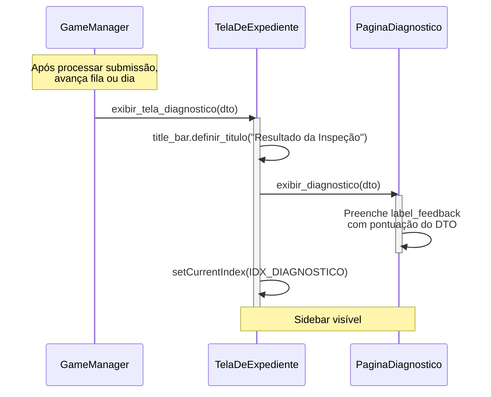
```mermaid
sequenceDiagram
    participant GM as GameManager
    participant TE as TelaDeExpediente
    participant PD as PaginaDiagnostico

    Note over GM: Após processar submissão,<br/>avança fila ou dia
    GM->>TE: exibir_tela_diagnostico(dto)
    activate TE
    TE->>TE: title_bar.definir_titulo("Resultado da Inspeção")
    TE->>PD: exibir_diagnostico(dto)
    activate PD
    PD->>PD: Preenche label_feedback<br/>com pontuação do DTO
    deactivate PD
    TE->>TE: setCurrentIndex(IDX_DIAGNOSTICO)
    Note over TE,PD: Sidebar visível
    deactivate TE
```

---

### 3.8 Continuar (Diagnóstico → próximo relatório ou fim)

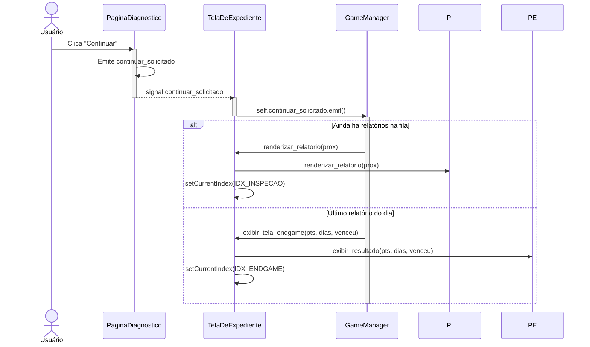
```mermaid
sequenceDiagram
    actor User as Usuário
    participant PD as PaginaDiagnostico
    participant TE as TelaDeExpediente
    participant GM as GameManager

    User->>PD: Clica "Continuar"
    activate PD
    PD->>PD: Emite continuar_solicitado
    PD-->>TE: signal continuar_solicitado
    deactivate PD
    activate TE
    TE->>GM: self.continuar_solicitado.emit()
    deactivate TE
    activate GM
    alt Ainda há relatórios na fila
        GM->>TE: renderizar_relatorio(prox)
        TE->>PI: renderizar_relatorio(prox)
        TE->>TE: setCurrentIndex(IDX_INSPECAO)
    else Último relatório do dia
        GM->>TE: exibir_tela_endgame(pts, dias, venceu)
        TE->>PE: exibir_resultado(pts, dias, venceu)
        TE->>TE: setCurrentIndex(IDX_ENDGAME)
    end
    deactivate GM
```

---

### 3.9 Endgame (Fim do Expediente)

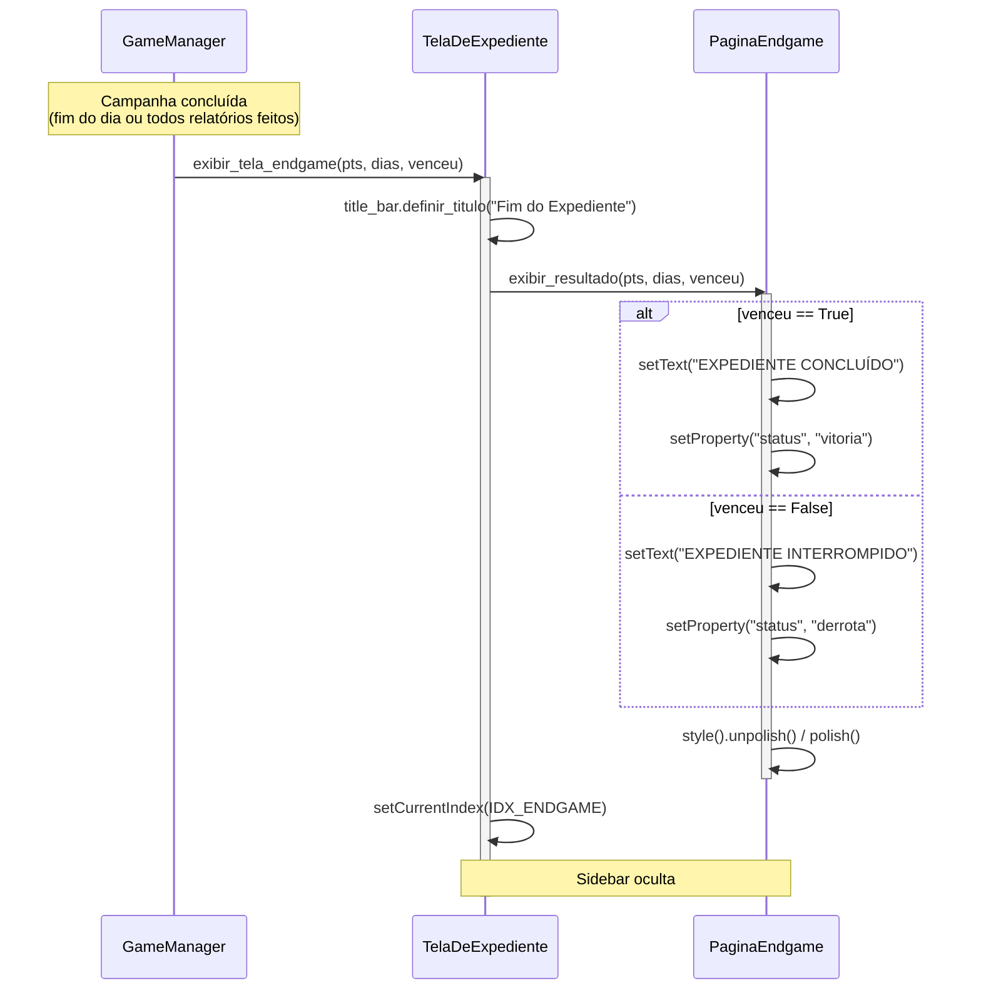
```mermaid
sequenceDiagram
    participant GM as GameManager
    participant TE as TelaDeExpediente
    participant PE as PaginaEndgame

    Note over GM: Campanha concluída<br/>(fim do dia ou todos relatórios feitos)
    GM->>TE: exibir_tela_endgame(pts, dias, venceu)
    activate TE
    TE->>TE: title_bar.definir_titulo("Fim do Expediente")
    TE->>PE: exibir_resultado(pts, dias, venceu)
    activate PE
    alt venceu == True
        PE->>PE: setText("EXPEDIENTE CONCLUÍDO")
        PE->>PE: setProperty("status", "vitoria")
    else venceu == False
        PE->>PE: setText("EXPEDIENTE INTERROMPIDO")
        PE->>PE: setProperty("status", "derrota")
    end
    PE->>PE: style().unpolish() / polish()
    deactivate PE
    TE->>TE: setCurrentIndex(IDX_ENDGAME)
    Note over TE,PE: Sidebar oculta
    deactivate TE
```

---

### 3.10 Voltar ao Menu (Endgame → Menu Principal)

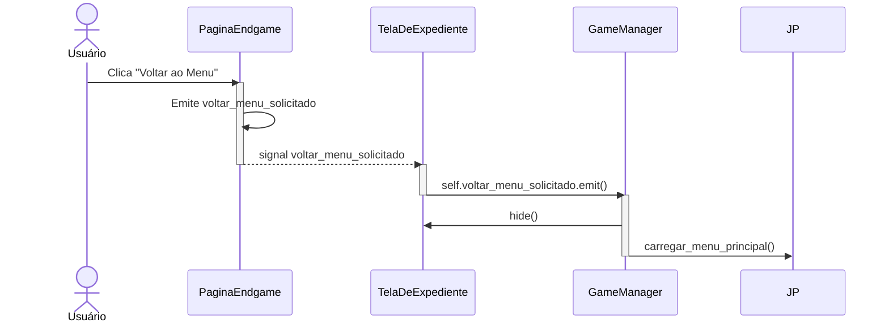
```mermaid
sequenceDiagram
    actor User as Usuário
    participant PE as PaginaEndgame
    participant TE as TelaDeExpediente
    participant GM as GameManager

    User->>PE: Clica "Voltar ao Menu"
    activate PE
    PE->>PE: Emite voltar_menu_solicitado
    PE-->>TE: signal voltar_menu_solicitado
    deactivate PE
    activate TE
    TE->>GM: self.voltar_menu_solicitado.emit()
    deactivate TE
    activate GM
    GM->>TE: hide()
    GM->>JP: carregar_menu_principal()
    deactivate GM
```

---

### 3.11 Reiniciar (reset do expediente)

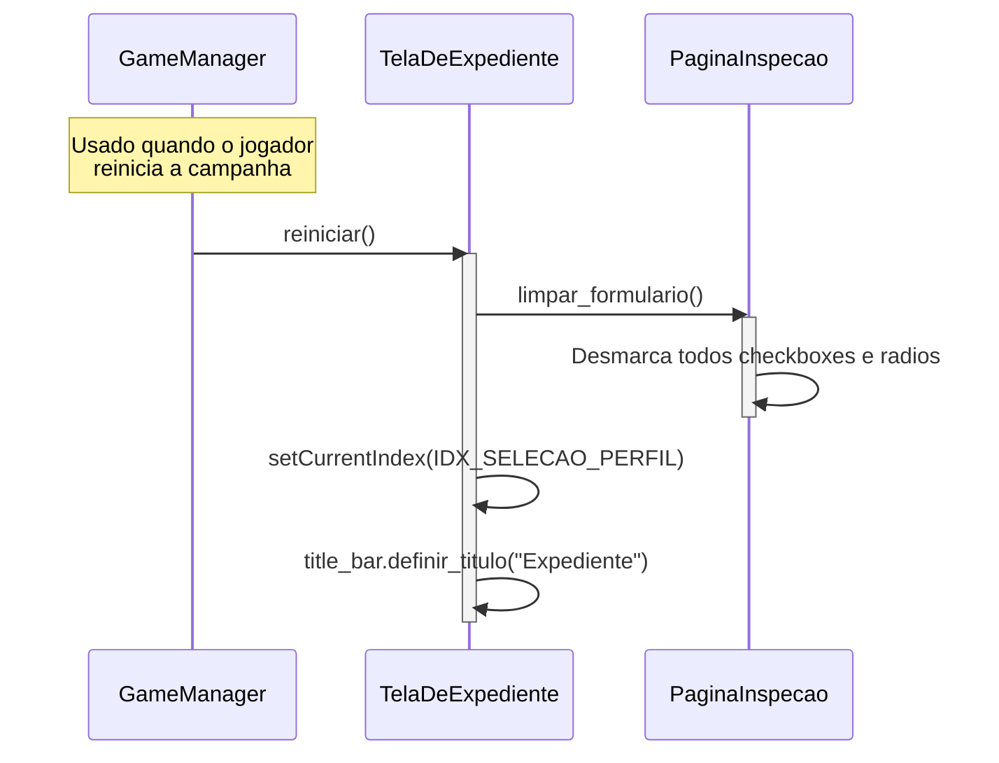
```mermaid
sequenceDiagram
    participant GM as GameManager
    participant TE as TelaDeExpediente
    participant PI as PaginaInspecao

    Note over GM: Usado quando o jogador<br/>reinicia a campanha
    GM->>TE: reiniciar()
    activate TE
    TE->>PI: limpar_formulario()
    activate PI
    PI->>PI: Desmarca todos checkboxes e radios
    deactivate PI
    TE->>TE: setCurrentIndex(IDX_SELECAO_PERFIL)
    TE->>TE: title_bar.definir_titulo("Expediente")
    deactivate TE
```

---

### 3.12 Resize da Janela

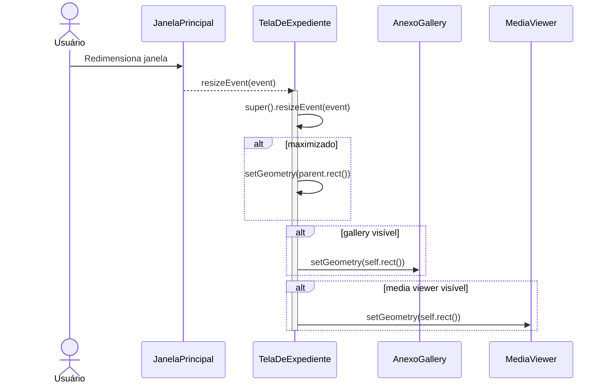
```mermaid
sequenceDiagram
    actor User as Usuário
    participant JP as JanelaPrincipal
    participant TE as TelaDeExpediente
    participant Gallery as AnexoGallery
    participant MV as MediaViewer

    User->>JP: Redimensiona janela
    JP-->>TE: resizeEvent(event)
    activate TE
    TE->>TE: super().resizeEvent(event)
    alt maximizado
        TE->>TE: setGeometry(parent.rect())
    end
    alt gallery visível
        TE->>Gallery: setGeometry(self.rect())
    end
    alt media viewer visível
        TE->>MV: setGeometry(self.rect())
    end
    deactivate TE
```

---

### 3.13 Gestão de Janela (Minimizar / Maximizar / Fechar)

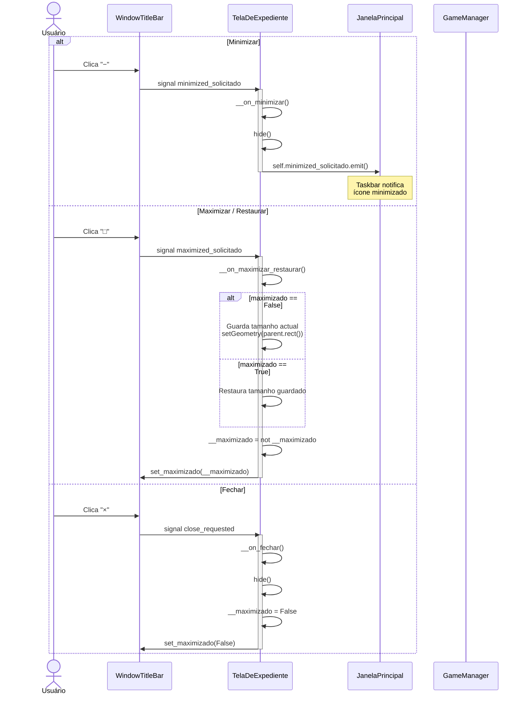
```mermaid
sequenceDiagram
    actor User as Usuário
    participant TB as WindowTitleBar
    participant TE as TelaDeExpediente
    participant JP as JanelaPrincipal
    participant GM as GameManager

    alt Minimizar
        User->>TB: Clica "−"
        TB->>TE: signal minimized_solicitado
        activate TE
        TE->>TE: __on_minimizar()
        TE->>TE: hide()
        TE->>JP: self.minimized_solicitado.emit()
        deactivate TE
        Note over JP: Taskbar notifica<br/>ícone minimizado
    else Maximizar / Restaurar
        User->>TB: Clica "□"
        TB->>TE: signal maximized_solicitado
        activate TE
        TE->>TE: __on_maximizar_restaurar()
        alt maximizado == False
            TE->>TE: Guarda tamanho actual<br/>setGeometry(parent.rect())
        else maximizado == True
            TE->>TE: Restaura tamanho guardado
        end
        TE->>TE: __maximizado = not __maximizado
        TE->>TB: set_maximizado(__maximizado)
        deactivate TE
    else Fechar
        User->>TB: Clica "×"
        TB->>TE: signal close_requested
        activate TE
        TE->>TE: __on_fechar()
        TE->>TE: hide()
        TE->>TE: __maximizado = False
        TE->>TB: set_maximizado(False)
        deactivate TE
    end
```

---

## 4. Tabela de Signals

| Signal | Emissor | Relay em TelaDeExpediente | Receptor final |
|---|---|---|---|
| `perfil_confirmado(str)` | `PaginaSelecaoPerfil` | `self.perfil_confirmado.emit(str)` | `GameManager.on_perfil_confirmado(str)` |
| `submeter_respostas(dict)` | `PaginaInspecao` | `self.submeter_respostas.emit(dict)` | `GameManager.on_submeter_respostas(dict)` |
| `continuar_solicitado()` | `PaginaDiagnostico` | `self.continuar_solicitado.emit()` | `GameManager.on_continuar()` |
| `voltar_menu_solicitado()` | `PaginaEndgame` | `self.voltar_menu_solicitado.emit()` | `GameManager.on_voltar_menu()` |
| `minimized_solicitado()` | `WindowTitleBar` | `self.minimized_solicitado.emit()` | `JanelaPrincipal.on_minimizar_expediente()` |

> **Nota:** `maximized_solicitado` foi removido na Fase 0 da refatoração — o maximize/restore é tratado internamente por `__on_maximizar_restaurar()` sem emitir signal público.

---

## 5. Fluxos de erro

### Tabela de referência rápida

| ID | Cenário | Condição | Resposta na UI |
|---|---|---|---|
| E1 | Gallery sem anexos | `__anexos_data` vazio ao clicar "Ver Anexos" | Nada acontece (early return silencioso) |
| E2 | MediaViewer com índice inválido | `indice` fora do range de `__anexos_data` | Nada acontece (early return) |
| E3 | GameManager lança excepção | Erro de domínio durante submissão | `QMessageBox.critical()` via JanelaPrincipal |
| E4 | Overlay visível durante resize | `AnexoGallery` ou `MediaViewer` abertos | Reposicionado por `resizeEvent` |

---

### E1 — Gallery sem anexos

**Condição:** o usuário clica "Ver Anexos" mas o relatório actual não tem anexos.

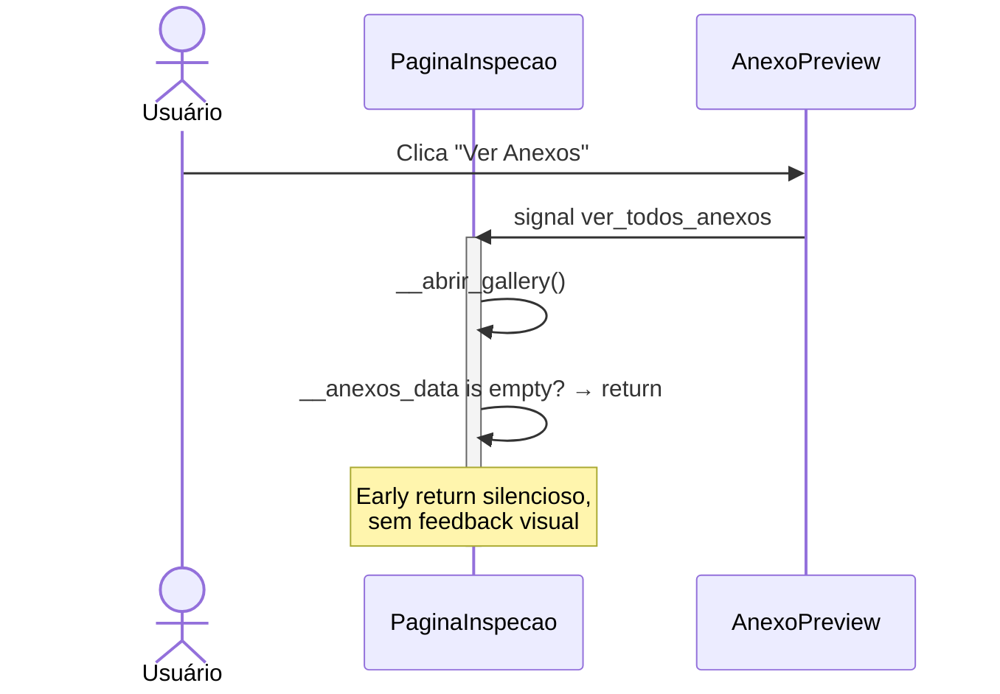
```mermaid
sequenceDiagram
    actor User as Usuário
    participant PI as PaginaInspecao
    participant Preview as AnexoPreview

    User->>Preview: Clica "Ver Anexos"
    Preview->>PI: signal ver_todos_anexos
    activate PI
    PI->>PI: __abrir_gallery()
    PI->>PI: __anexos_data is empty? → return
    Note over PI: Early return silencioso,<br/>sem feedback visual
    deactivate PI
```

**Decisão:** o early return é proposital — o `AnexoPreview` já mostra "0 anexos" nos metadados, portanto o usuário não espera que a gallery abra.

---

### E3 — Erro do GameManager propagado

**Condição:** o `GameManager` lança uma excepção ao processar submissão (ex: decisão inválida, tempo negativo). A excepção é capturada e convertida em pop-up.

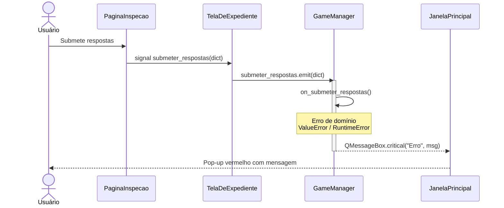
```mermaid
sequenceDiagram
    actor User as Usuário
    participant PI as PaginaInspecao
    participant TE as TelaDeExpediente
    participant GM as GameManager
    participant JP as JanelaPrincipal

    User->>PI: Submete respostas
    PI->>TE: signal submeter_respostas(dict)
    TE->>GM: submeter_respostas.emit(dict)
    activate GM
    GM->>GM: on_submeter_respostas()
    Note over GM: Erro de domínio<br/>ValueError / RuntimeError
    GM-->>JP: QMessageBox.critical("Erro", msg)
    deactivate GM
    JP-->>User: Pop-up vermelho com mensagem
```

**Decisão:** o `GameManager` é a barreira de excepções — nenhum `ValueError` ou `RuntimeError` do domínio vaza para a View.

---

## 6. Referências

- Código fonte: `view/screens/tela_de_expediente.py` (207 linhas)
- Páginas extraídas: `view/screens/pagina_selecao_perfil.py`, `pagina_loading.py`, `pagina_inspecao.py`, `pagina_diagnostico.py`, `pagina_endgame.py`
- Overlays: `view/screens/anexo_gallery.py`, `view/screens/media_viewer.py`
- Presenter: `application/controllers/game_manager.py`
- View contract: `application/interfaces/i_game_view.py`
- Plano de refactor: `temp/plano_refatoracao_tela_de_expediente.md`
