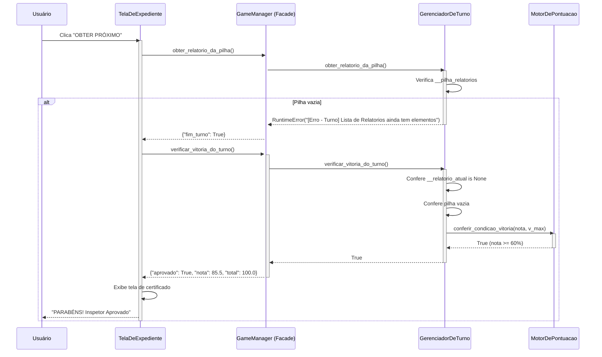
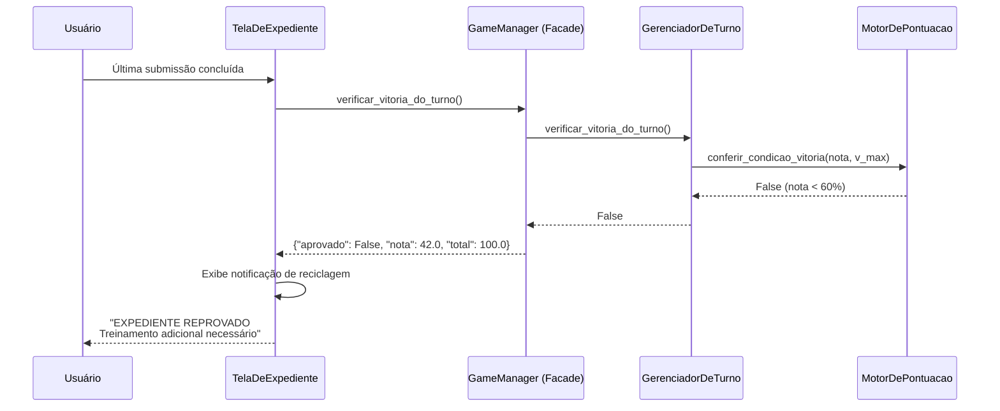
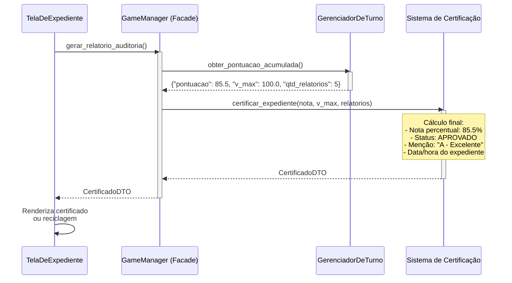
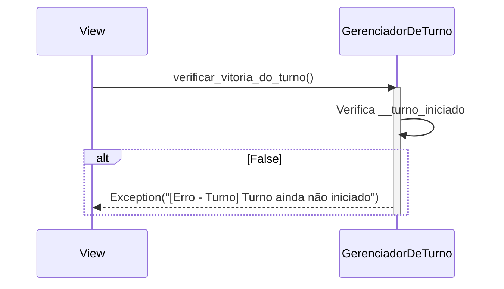
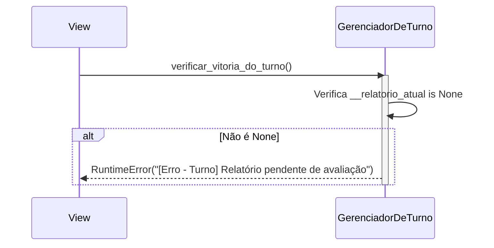
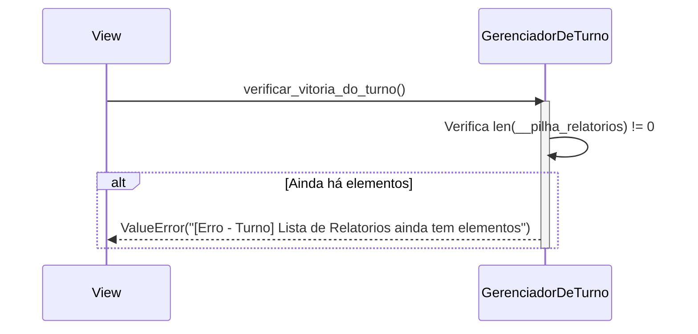

# Fim de Expediente (Auditoria / Game Over) — Diagrama de sequência

---

## 1. Pré-condições e pós-condições

### Pré-condições

- [ ] Turno iniciado e todos os relatórios da pilha já foram avaliados
- [ ] `__relatorio_atual is None` (nenhum relatório pendente)
- [ ] `__pilha_relatorios` vazia
- [ ] `__pontuacao_acumulada_turno` e `__v_max_turno` calculados ao longo do turno

### Pós-condições

- [ ] `verificar_vitoria_do_turno()` retorna `True` ou `False`
- [ ] Auditoria de expediente gerada com nota final, status e desempenho por categoria
- [ ] UI exibe tela de certificado (aprovado) ou notificação de reciclagem (reprovado)
- [ ] Log de auditoria registrado em disco

---

## 2. Diagrama de sequência

### Fluxo principal (caminho feliz — Aprovado)

### Fluxo alternativo — Reprovado

### Fluxo de auditoria — Geração do relatório final

---

## 3. Fluxos de erro

### Tabela de referência rápida

| ID | Cenário | Condição de disparo | Resposta ao usuário |
|----|---------|---------------------|---------------------|
| E1 | Turno não iniciado | `verificar_vitoria_do_turno()` sem turno ativo | `Exception("[Erro - Turno] Turno ainda não iniciado")` |
| E2 | Relatório pendente | Turno ainda tem relatório ativo sem avaliação | `RuntimeError("[Erro - Turno] Relatório pendente de avaliação")` |
| E3 | Pilha não vazia | Ainda há relatórios não jogados na pilha | `ValueError("[Erro - Turno] Lista de Relatorios ainda tem elementos")` |

---

### E1 — Turno não iniciado

**Condição:** `verificar_vitoria_do_turno()` chamado sem `__turno_iniciado`.

**Decisão:** guarda padrão do `GerenciadorDeTurno` — sem turno, nenhuma operação de verificação faz sentido.

---

### E2 — Relatório pendente

**Condição:** jogador tentou encerrar sem avaliar o último relatório.

**Decisão:** impede que o sistema gere auditoria com dados incompletos. O jogador precisa submeter ou descartar o relatório ativo.

---

### E3 — Pilha não vazia

**Condição:** jogador tentou encerrar o turno com relatórios não jogados.

**Decisão:** a integridade da auditoria exige que todos os cenários do turno tenham sido respondidos. O jogador deve completar a pilha inteira antes de ver seu resultado final.
