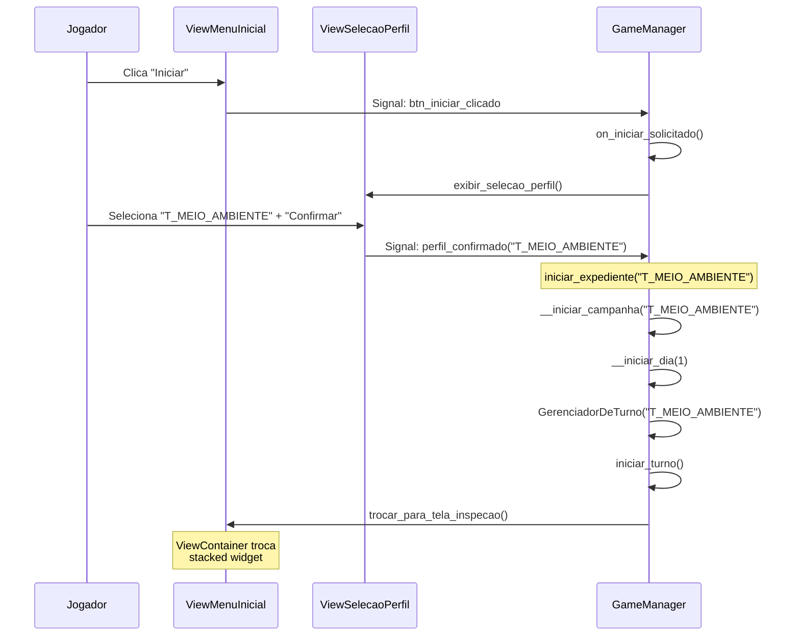
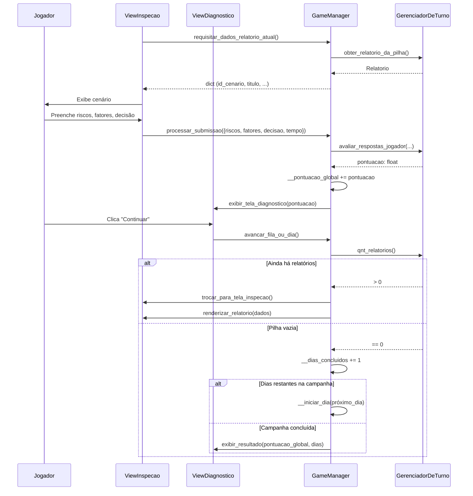
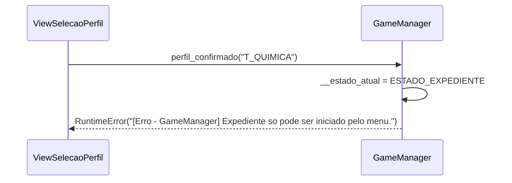
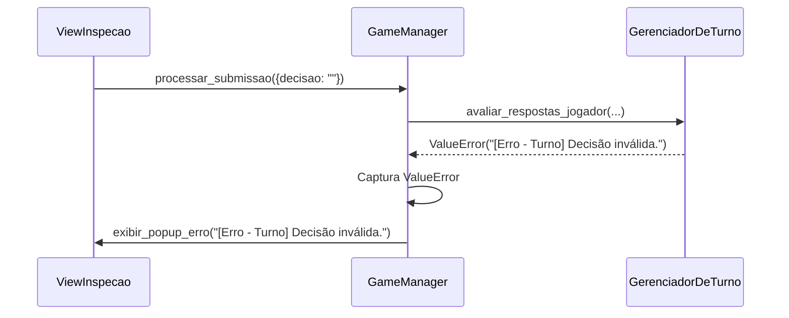

# GameManager — Conexão View-Controller (MVP)

---

## 1. Pré-condições e pós-condições

### Pré-condições

- [ ] `GameManager` instanciado com View injetada
- [ ] Aplicação inicializada via `iniciar_aplicacao()`
- [ ] Estado `ESTADO_MENU` ativo, `ViewMenuInicial` visível

### Pós-condições

- [ ] Perfil selecionado armazenado em `__perfil_selecionado`
- [ ] `GerenciadorDeTurno` criado e turno iniciado
- [ ] View trocada para tela de inspeção com primeiro relatório

---

## 2. Diagrama de sequência

### Fluxo principal (Menu → Expediente)

### Fluxo principal (Inspeção → Diagnóstico → Avanço)

---

## 3. Fluxos de erro

### Tabela de referência rápida

| ID | Cenário | Condição de disparo | Resposta na UI |
|----|---------|---------------------|----------------|
| E1 | Expediente fora do menu | `iniciar_expediente()` chamado fora de `ESTADO_MENU` | `RuntimeError` com tag `[Erro - GameManager]` |
| E2 | Submissão sem turno | `processar_submissao()` sem `__gerenciador_turno` ativo | `RuntimeError` com tag `[Erro - GameManager]` |
| E3 | Regra de negócio violada | Turno lança `ValueError` (ex: decisão inválida) | `view.exibir_popup_erro()` com a mensagem |
| E4 | Erro interno inesperado | Falha não mapeada no domínio | `logger.error()` + `view.exibir_popup_erro()` genérico |

### E1 — Expediente fora do menu

**Condição:** `iniciar_expediente()` é chamado enquanto `__estado_atual != ESTADO_MENU`.

### E3 — Regra de negócio violada

**Condição:** o turno lança `ValueError` durante `avaliar_respostas_jogador()`.

---

## 4. Métodos públicos da View (Contrato MVP)

| Método | Chamado por | Função |
|--------|-------------|--------|
| `inicializar()` | `iniciar_aplicacao()` | Prepara a janela principal |
| `fechar()` | `encerrar_aplicacao()` | Encerra a aplicação |
| `exibir_menu()` | `carregar_menu_principal()` | Mostra `ViewMenuInicial` |
| `exibir_selecao_perfil()` | `on_iniciar_solicitado()` | Mostra `ViewSelecaoPerfil` |
| `trocar_para_tela_inspecao()` | `__iniciar_dia()` | Mostra `ViewInspecao` |
| `exibir_tela_diagnostico(pontuacao)` | `processar_submissao()` | Mostra `ViewDiagnostico` |
| `renderizar_relatorio(dados)` | `avancar_fila_ou_dia()` | Alimenta `ViewInspecao` com dados |
| `exibir_resultado(pont_global, dias)` | `__encerrar_campanha()` | Mostra tela de resultados |
| `exibir_popup_erro(mensagem)` | Todos os catchs | Exibe pop-up de erro |
