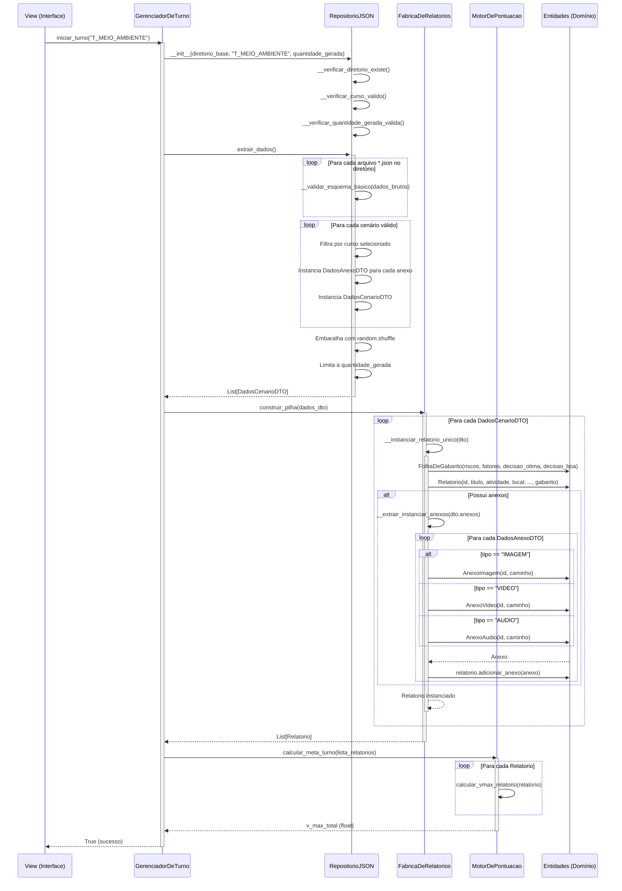
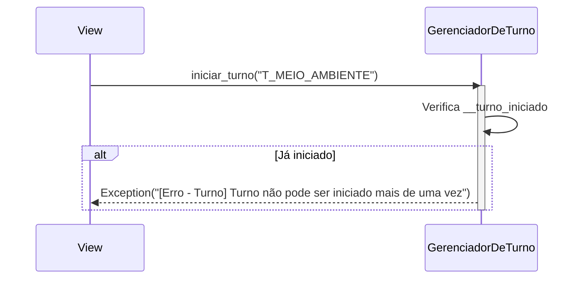
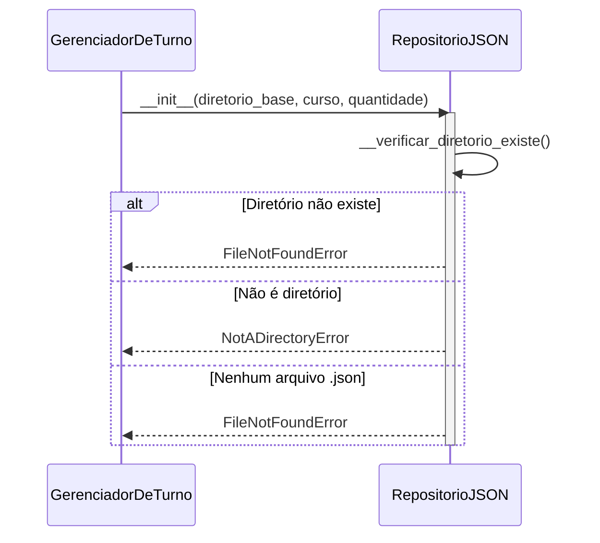
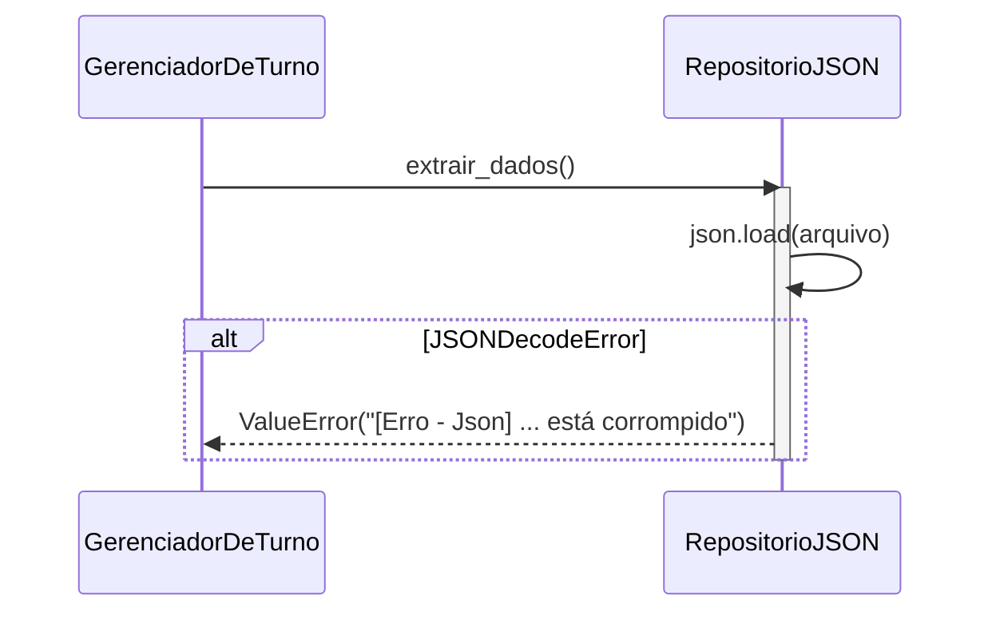
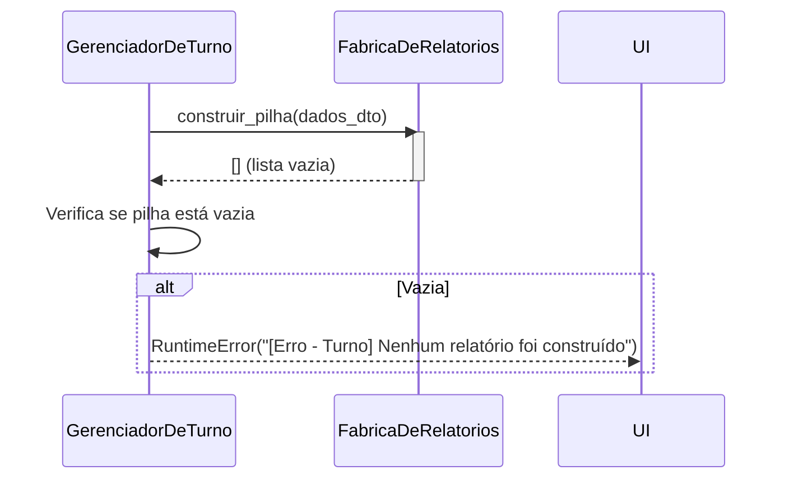

# Inicialização do Expediente — Diagrama de sequência

---

## 1. Pré-condições e pós-condições

### Pré-condições

- [ ] `GerenciadorDeTurno` instanciado com um perfil de curso válido (ex: `"T_MEIO_AMBIENTE"`)
- [ ] Diretório base de cenários (`DIRETORIO_BASE`) existe e contém arquivos `*.json`
- [ ] `QUANTIDADE_GERADA` é um inteiro positivo

### Pós-condições

- [ ] Estado `__turno_iniciado = True`
- [ ] `__pilha_relatorios` populada com entidades `Relatorio` prontas para consumo
- [ ] `__v_max_turno` calculado (somatório do Vmax individual de cada relatório)
- [ ] `__pontuacao_acumulada_turno = 0.0` e `__relatorio_atual = None`

---

## 2. Diagrama de sequência

### Fluxo principal (caminho feliz)

---

## 3. Fluxos de erro

### Tabela de referência rápida

| ID | Cenário | Condição de disparo | Resposta ao usuário |
|----|---------|---------------------|---------------------|
| E1 | Turno já iniciado | `iniciar_turno()` chamado duas vezes | `Exception("[Erro - Turno] Turno não pode ser iniciado mais de uma vez")` |
| E2 | Diretório não encontrado | `DIRETORIO_BASE` não existe ou não é diretório | `FileNotFoundError / NotADirectoryError` |
| E3 | Curso inválido | Perfil não pertence a `CURSOS_VALIDOS` | `ValueError("[Erro - Curso] ... não é válido")` |
| E4 | JSON mal formatado | Arquivo `.json` corrompido | `ValueError("[Erro - Json] ... está corrompido")` |
| E5 | Schema inválido | Estrutura do JSON fora do esquema | `KeyError / TypeError / ValueError` (conforme `__traduzir_erro_validacao`) |
| E6 | Nenhum cenário compatível | Nenhum cenário para o curso selecionado | `ValueError("[Aviso] Nenhum cenário encontrado")` |
| E7 | Nenhum relatório construído | Todos os DTOs falharam ao instanciar | `RuntimeError("[Erro - Turno] Nenhum relatório foi construído")` |

---

### E1 — Turno já iniciado

**Condição:** `iniciar_turno()` é invocado quando `__turno_iniciado` já é `True`.

**Decisão:** turno é singleton por sessão — reiniciar exigiria um novo objeto `GerenciadorDeTurno`.

---

### E2 — Diretório não encontrado

**Condição:** o caminho `DIRETORIO_BASE` não existe ou não contém arquivos `.json`.

**Decisão:** validações defensivas falham rápido na construção do repositório, antes de qualquer I/O.

---

### E4 — JSON mal formatado

**Condição:** um arquivo `.json` do diretório contém sintaxe inválida (`json.JSONDecodeError`).

**Decisão:** o erro é convertido para `ValueError` para manter a camada de aplicação independente de detalhes de parsing.

---

### E7 — Nenhum relatório construído

**Condição:** a fábrica retornou uma lista vazia (todos os DTOs falharam na instanciação).

**Decisão:** a guarda evita que o turno inicie sem conteúdo jogável, forçando o operador a corrigir os dados de entrada.
