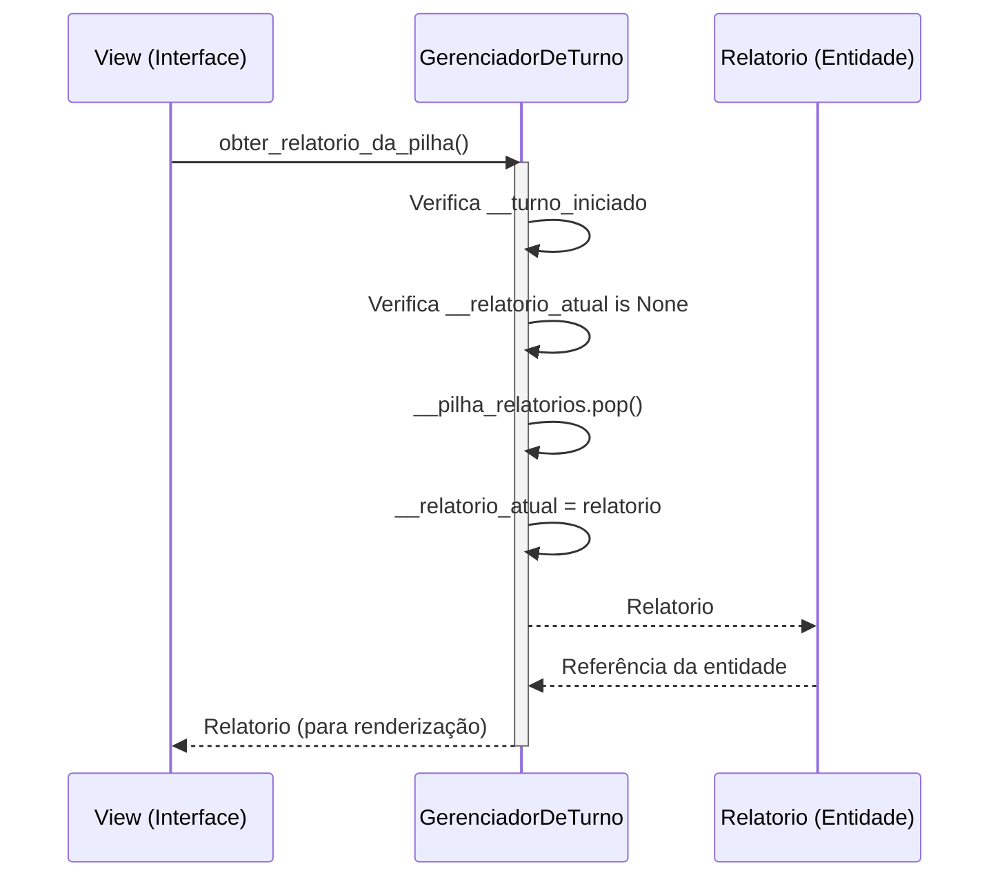
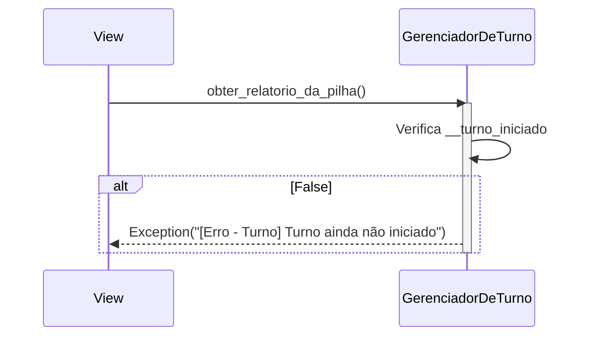
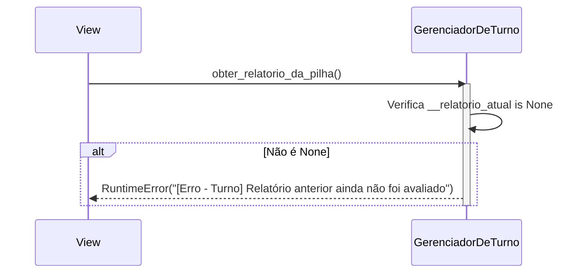

# Laço de Jogo — Diagrama de sequência

---

## 1. Pré-condições e pós-condições

### Pré-condições

- [ ] Turno iniciado com sucesso (`iniciar_turno()` retornou `True`)
- [ ] `__pilha_relatorios` contém pelo menos um `Relatorio`
- [ ] Nenhum relatório pendente de avaliação (`__relatorio_atual is None`)

### Pós-condições

- [ ] `__relatorio_atual` contém o `Relatorio` removido da pilha (modo LIFO)
- [ ] Tamanho da `__pilha_relatorios` reduzido em 1
- [ ] A entidade `Relatorio` é retornada para a UI renderizar os dados de apresentação

---

## 2. Diagrama de sequência

### Fluxo principal (caminho feliz)

---

## 3. Fluxos de erro

### Tabela de referência rápida

| ID | Cenário | Condição de disparo | Resposta ao usuário |
|----|---------|---------------------|---------------------|
| E1 | Turno não iniciado | `obter_relatorio_da_pilha()` chamado sem turno ativo | `Exception("[Erro - Turno] Turno ainda não iniciado")` |
| E2 | Relatório pendente | Relatório anterior ainda não foi avaliado | `RuntimeError("[Erro - Turno] Relatório anterior ainda não foi avaliado")` |

---

### E1 — Turno não iniciado

**Condição:** `obter_relatorio_da_pilha()` ou `qnt_relatorios()` são chamados antes de `iniciar_turno()`.

**Decisão:** todas as operações do turno dependem da flag `__turno_iniciado` — sem ela, o `GerenciadorDeTurno` não tem estado coerente para operar.

---

### E2 — Relatório pendente

**Condição:** `obter_relatorio_da_pilha()` é chamado enquanto `__relatorio_atual` ainda não foi limpo (ou seja, o jogador não submeteu a resposta do relatório anterior).

**Decisão:** protege a integridade do ciclo "obter → avaliar → obter próximo". O jogador não pode pular relatórios sem respondê-los.
