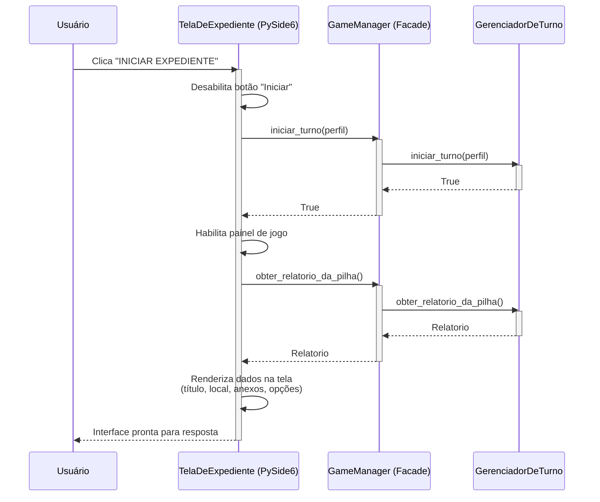
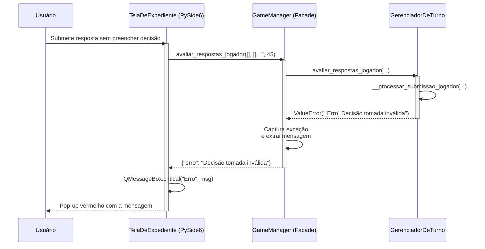
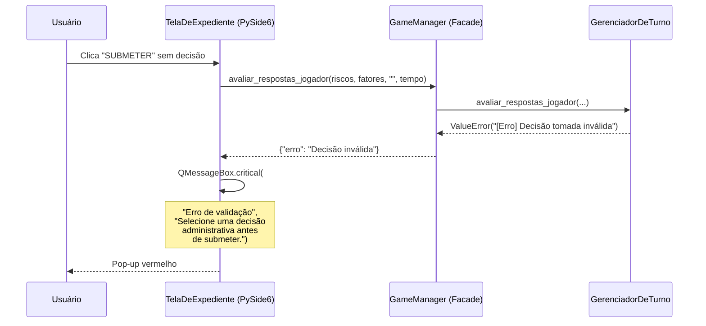
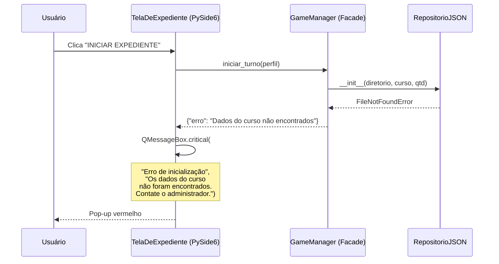
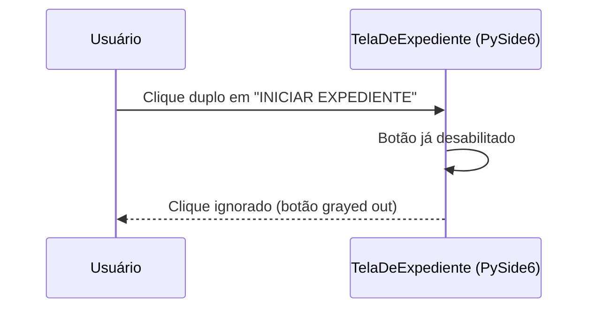

# Integração View-Controller (MVP) — Diagrama de sequência

---

## 1. Pré-condições e pós-condições

### Pré-condições

- [ ] Aplicação PySide6 inicializada com `QApplication` e `setup_logging()`
- [ ] `GameManager` instanciado com um perfil de curso válido
- [ ] `TelaDeExpediente` construída e conectada aos sinais do `GameManager`
- [ ] Turno ainda não iniciado (botão "Iniciar Expediente" visível)

### Pós-condições

- [ ] Turno iniciado e `TelaDeExpediente` exibindo o primeiro relatório
- [ ] Ou: mensagem de erro exibida em `QMessageBox` sem corromper o estado da View
- [ ] Todos os `ValueError` e `RuntimeError` do domínio convertidos em pop-ups modais

---

## 2. Diagrama de sequência

### Fluxo principal (caminho feliz)

### Fluxo alternativo — Erro de domínio capturado pelo Facade

---

## 3. Fluxos de erro

### Tabela de referência rápida

| ID | Cenário | Condição de disparo | Resposta na UI |
|----|---------|---------------------|----------------|
| E1 | Decisão não preenchida | Jogador submete sem decisão ou valor inválido | `QMessageBox.critical("Decisão inválida")` |
| E2 | Tempo negativo ou zerado | Cronômetro corrompido ou manipulado | `QMessageBox.critical("Tempo inválido")` |
| E3 | Curso inválido | Perfil não reconhecido na inicialização | `QMessageBox.critical("Curso não encontrado")` |
| E4 | Nenhum arquivo JSON | Diretório de dados vazio ou ausente | `QMessageBox.critical("Dados do curso não encontrados")` |
| E5 | Turno já iniciado | Duplo clique no botão "Iniciar" | Botão já desabilitado; fallback silencioso |
| E6 | Erro inesperado (5xx lógico) | Falha interna sem mensagem amigável | `QMessageBox.critical("Erro interno")` + log |

---

### E1 — Decisão não preenchida

**Condição:** o jogador submete a resposta com `decisao == ""` ou valor fora de `["INTERDITAR", "ADVERTIR", "IGNORAR"]`.

**Decisão:** o `GameManager` atua como barreira de exceções: nenhum `ValueError` ou `RuntimeError` do domínio vaza para a View. Toda exceção é convertida em um dicionário `{"erro": msg}` que a UI lê para exibir o `QMessageBox`.

---

### E4 — Nenhum arquivo JSON

**Condição:** o diretório base não contém arquivos `.json` ou o diretório não existe.

**Decisão:** o Facade unifica todos os erros de I/O (FileNotFoundError, JSONDecodeError, ValidationError) em uma única mensagem amigável. O detalhe técnico vai para o arquivo de log (`errors.log`) via `logger.error()`.

---

### E5 — Turno já iniciado

**Condição:** duplo clique acidental no botão "Iniciar Expediente".

**Decisão:** a UI desabilita o botão na primeira chamada, antes mesmo de contactar o `GameManager`. Isso evita chamadas redundantes e dá feedback visual imediato ao usuário. A guarda no `GerenciadorDeTurno` é a proteção em nível de domínio caso a UI falhe.
