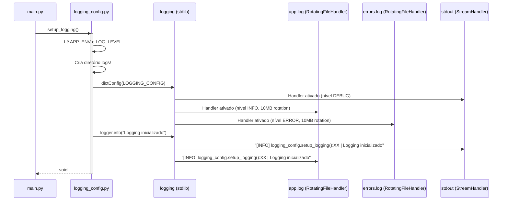
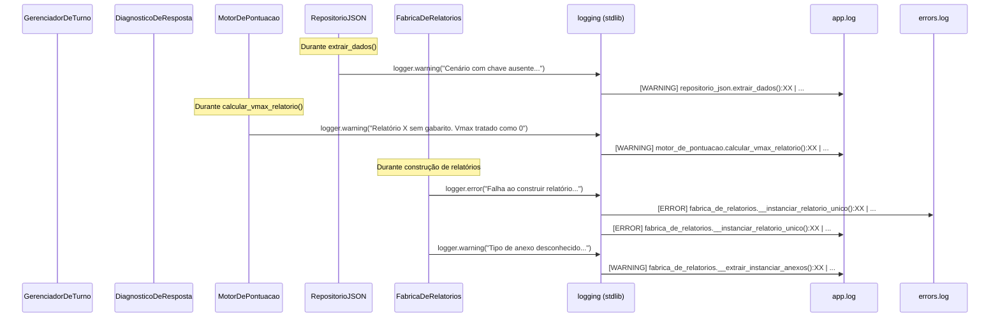
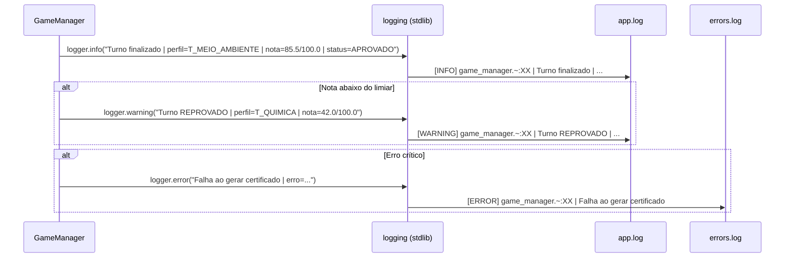
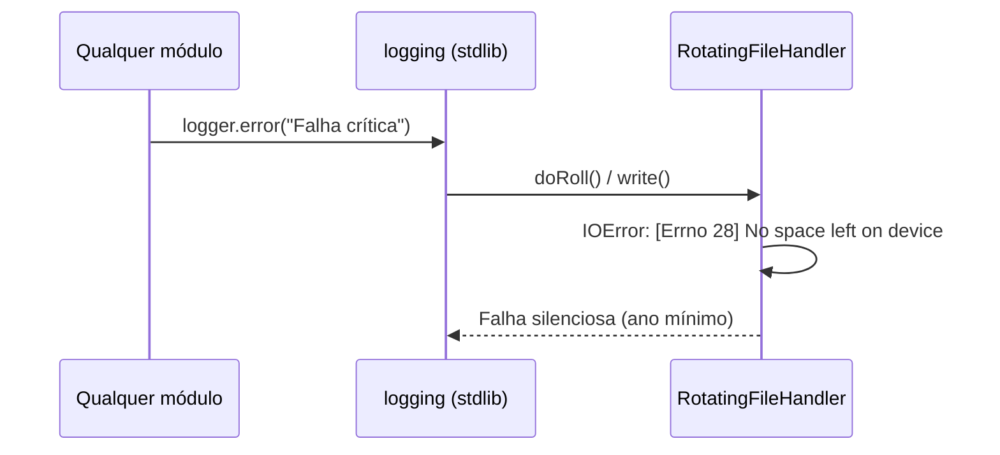
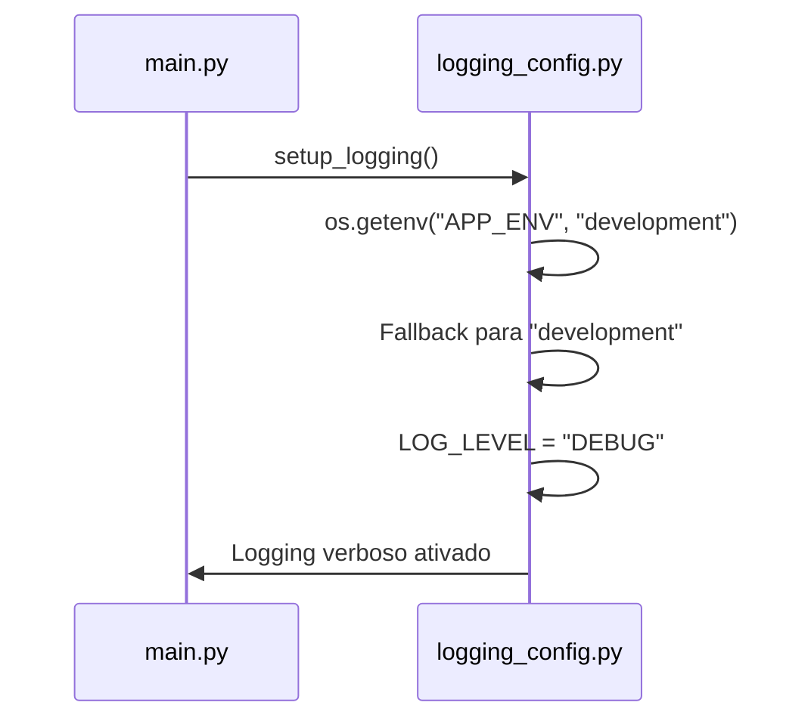
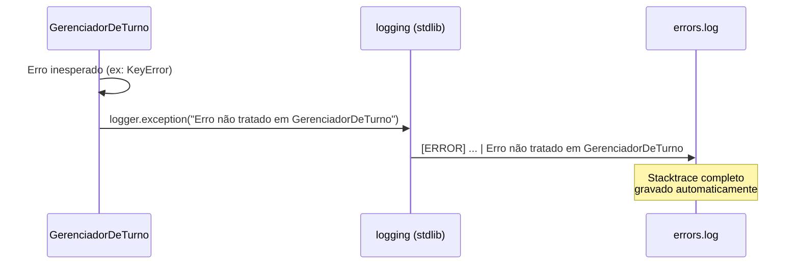

# Telemetria / Logs — Diagrama de sequência

---

## 1. Pré-condições e pós-condições

### Pré-condições

- [ ] `setup_logging()` chamado uma vez no entry-point (`main.py`)
- [ ] Diretório `logs/` criado automaticamente com permissão de escrita
- [ ] Variável de ambiente `APP_ENV` definida (`development`, `staging` ou `production`)
- [ ] Módulos importam `logging` e criam `logger = logging.getLogger(__name__)`

### Pós-condições

- [ ] Mensagens de DEBUG/INFO gravadas em `logs/app.log` (com rotação de 10 MB)
- [ ] Mensagens de ERROR/CRITICAL gravadas em `logs/errors.log`
- [ ] Console colorido exibindo logs em tempo real (apenas em development/staging)
- [ ] Nenhuma exceção não tratada escapa sem registro

---

## 2. Diagrama de sequência

### Fluxo principal — Inicialização do logging

### Fluxo principal — Log durante o Game Loop

### Fluxo de auditoria — Log de fim de expediente

---

## 3. Fluxos de erro

### Tabela de referência rápida

| ID | Cenário | Condição de disparo | Comportamento |
|----|---------|---------------------|---------------|
| E1 | Handler de arquivo sem espaço | Disco cheio durante rotação | `RotatingFileHandler` falha silenciosamente; console ainda funciona |
| E2 | Ambiente sem `APP_ENV` | Variável não definida | Fallback para `development` (modo verboso seguro) |
| E3 | Log de exceção não capturada | Erro fora dos blocos try/except | `logging.exception()` registra stacktrace completo em `errors.log` |
| E4 | Nível inválido via `LOG_LEVEL` | Valor digitado incorretamente | Fallback para o nível do ambiente |

---

### E1 — Disco cheio

**Condição:** o diretório `logs/` está em um volume sem espaço.

**Decisão:** o `RotatingFileHandler` da stdlib não propaga exceções de I/O para o chamador. O console continua operacional. Em produção, o handler `console` é o único ativo, evitando dependência de disco.

---

### E2 — Ambiente sem `APP_ENV`

**Condição:** variável `APP_ENV` não definida no sistema.

**Decisão:** `development` é o fallback seguro — logs detalhados em ambiente local nunca escondem informação. Em produção, o deploy define `APP_ENV=production` para reduzir ruído.

---

### E3 — Exceção não capturada

**Condição:** erro inesperado escapa sem try/except no código de aplicação.

**Decisão:** `logger.exception()` é usado em blocos `except` para registrar o stacktrace completo. O erro é então relançado ou convertido em mensagem amigável para a UI, garantindo rastreabilidade sem vazar detalhes internos.
