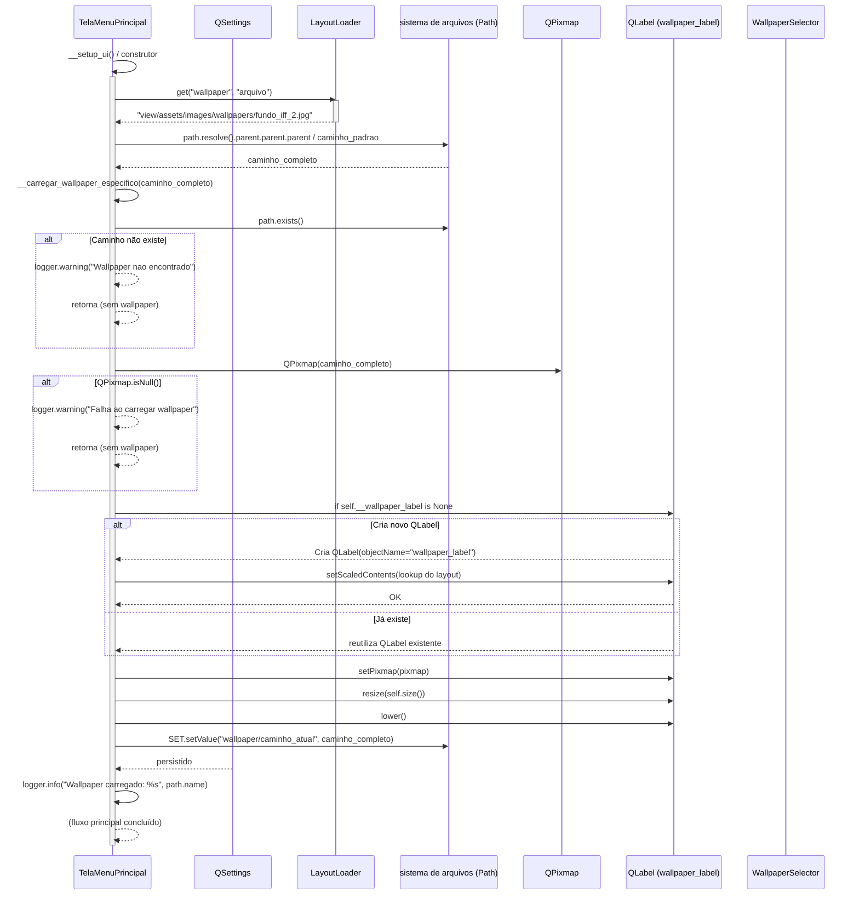
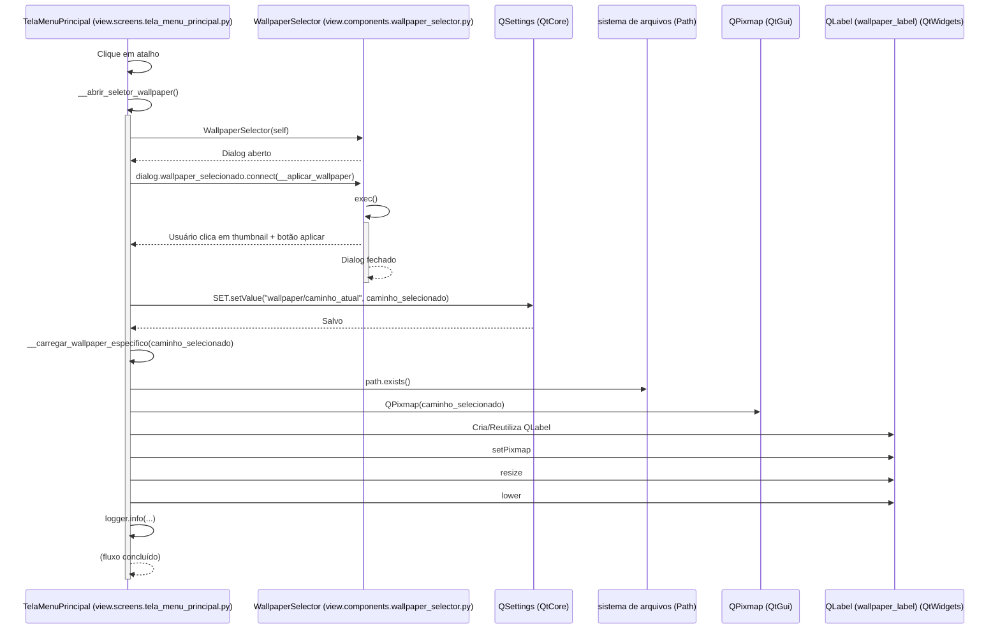
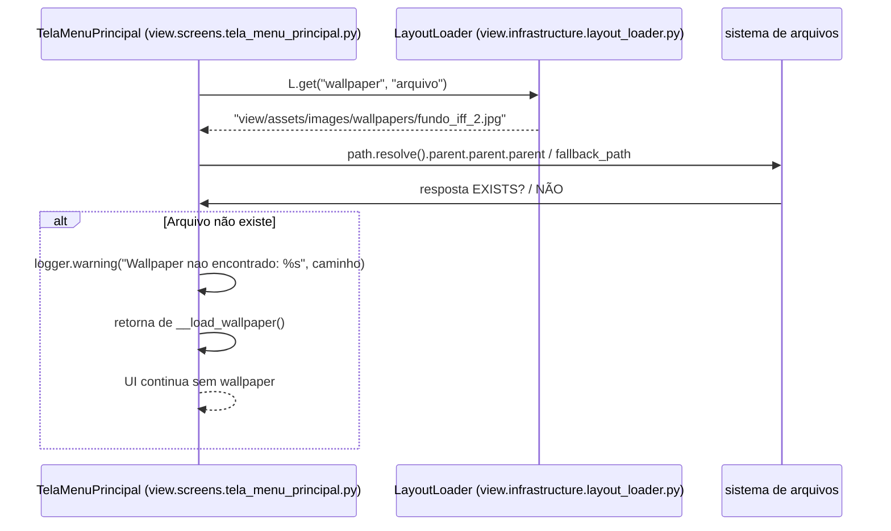
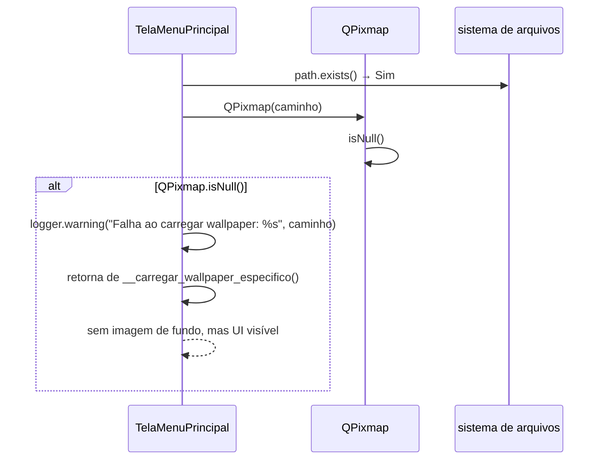

# Troca de Wallpaper — Diagrama de sequência

---

## 1. Pré-condições e pós-condições

### Pré-condições

- [ ] `TelaMenuPrincipal` instanciado e exibido (`z=1`)
- [ ] `QSettings` disponível (persistência do Qt)
- [ ] Arquivo de wallpaper padrão existe (`layout.json` fornece "arquivo": "view/assets/images/wallpapers/fundo_iff_2.jpg")
- [ ] Layout Loader configurado com resolução e factor de escala válidos
- [ ] Folha de estilos carregada (estilos básicos aplicados)

### Pós-condições

- [ ] Wallpaper aplicado: QLabel com QPixmap visível no `TelaMenuPrincipal`
- [ ] Novo caminho salvo em `QSettings["wallpaper/caminho_atual"]`
- [ ] Histórico de navegação salva: Papel de parede anterior mantido em memória se solicitado
- [ ] Validação de arquivo concluída: Log de quaisquer warnings/errors de carregamento não-sensível

---

## 2. Diagrama de sequência

### Fluxo principal (caminho feliz)



---

## 3. Fluxo de alteração (usuário seleciona novo wallpaper)



---

## 4. Fluxos de erro

### Tabela de referência rápida

| ID | Cenário                | Condição de disparo                                      | Resposta ao usuário                         |
|----|------------------------|-----------------------------------------------------------|---------------------------------------------|
| S1 | Arquivo padrão não encontrado | `Path.exists()` falso para caminho padrão após fallback | `warning` registrado, continua sem wallpaper |
| S2 | Arquivo corrompido/inválido | `QPixmap().isNull()` verdadeiro                         | `warning` registrado, continua sem wallpaper |
| S3 | QSettings falhou            | `QSettings::setValue()` falha                            | Sem persistência, mas wallpaper ainda exibe |
| S4 | Usuário cancela seleção de diálogo | `exec()` retorna sem caminho                   | Sem alterações, diálogo fecha silenciosamente |

### S1 — Arquivo padrão não encontrado

**Condição:** layout.json fornece um nome de arquivo padrão que não existe no sistema de arquivos.



**Decisão:** Sem wallpaper padrão, mas app continua funcionando (área de desktop visível).

### S2 — Arquivo corrompido/inválido

**Condição:** path.exists() é verdadeiro mas QPixmap.isNull() é verdadeiro (formato inválido,损坏, etc.).



**Decisão:** Tolerante a falhas - continua sem wallpaper visual.

---

## 5. Observações de design e separação de responsabilidades

### Separação de responsabilidades

| Método | Responsabilidade |
|--------|-----------------
| `__load_wallpaper()` | Apenas decide qual arquivo usar: QSettings → fallback layout.json |
| `__carregar_wallpaper_especifico()` | Apenas carrega/exibe um arquivo específico que já tem seu caminho decidido |
| `__abrir_seletor_wallpaper()` | Apenas abre o diálogo, delega decisão/salvamento para __aplicar_wallpaper |
| `__aplicar_wallpaper()` | Salva novo caminho (QSettings) → decide via __carregar_wallpaper_especifico() |

### Fluxo de dados entre camadas

```text
Camada de UI (View)
├── QSettings (Persistência)
├── LayoutLoader (Configuração)
├── sistema de arquivos (Fontes)
└── QPixmaps (Imagens)

Interações:
  1. Componente de UI precisa de um wallpaper → decide qual usar
  2. Problema de UI: qual arquivo vs como exibir
  3. Passa completamente as preocupações
```

### Comportamento tolerante a falhas

- Tolerante a erros: Sem wallpaper = Desktop funcional
- Sem tela azul (sem crash)
- Log de warnings para audit trail
- Interface continua sendo usada mesmo sem wallpaper visual

### Fluxo de controle de persistência

```text
Usuário → WallpaperSelector → UI → QSettings → Sistema de arquivos persistido
     ↑
     └── (leitura na próxima inicialização do UI via __load_wallpaper())
```

### Decisões de design

1. **Decisão de design:** QSettings antes de fallback layout.json → Respeita desejo do usuário, mantém personalização que o usuário realmente fez.
2. **Decisão de design:** No fluxo de mudança, salvação QSettings antes de exibição → Se o app travar, pelo menos o caminho do wallpaper selecionado está salvo.
3. **Decisão de design:** Arquivo padrão não encontrado continua sem wallpaper → Sem golpe baixo se um arquivo for excluído; app ainda funcional.
4. **Decisão de design:** Separação de resolver caminho vs exibir caminho → Permite reutilizar o carregador quando usuário deseja trocar, sem verificar novamente QSettings.

### Padrões de integração

- **Fluxo de sinal do Qt:** `wallpaper_selecionado` conecta `WallpaperSelector` → `TelaMenuPrincipal`
- **Separador de preocupações:** Carregador de layout desacoplado do painting Qt
- **Pipeline de persistência:** QSettings como ponte entre camada de UI e preferências do usuário

### Componentes envolvidos

| Componente | Arquivo | Funções de alta camada |
|-------------|--------|------------------------|
| `TelaMenuPrincipal` | `view/screens/tela_menu_principal.py` | Interface principal, atalhos, alternação de desktop ↔ overlay |
| `WallpaperSelector` | `view/components/wallpaper_selector.py` | Diálogo de seleção de arquivo via sistema de arquivos do Windows |
| `LayoutLoader` | `view/infrastructure/layout_loader.py` | Leitura de layout.json para padrões de UI, fonte do fallback padrão |
| `QSettings` | Qt Core | Persistência de configurações entre sessões |

---

## 6. Fluxo cronológico resumido

1. **Inicialização:** `TelaMenuPrincipal` criado → `__load_wallpaper()` decide qual usar
2. **Primeira vez:** Sem QSettings salvo → fallback para layout.json padrão
3. **Usuário clica:** Atalho #4 (`Personalizar Papel de Parede`) → abre diálogo
4. **Usuário seleciona:** Escolhe novo arquivo + OK → persistência QSettings + recarga
5. **Sistema:** Verifica existência do arquivo → tenta carregar → exibe → loga resultado
6. **Resultado:** Novo wallpaper aplicado + salvo para próximas aberturas, app continua funcional mesmo sem wallpaper

## Observações de manutenção

- **Lista de verificação de teste:** Arquivo padrão existe? Caminho do usuário existe? Formato de imagem é válido?
- **Monitoramento de fluxo:** QSettings corrupção vs layout.json danificado
- **Rastreabilidade de defeitos:** Sem wallpaper → continua para desktop com atalhos (visível)
- **Extensibilidade:** Poderia adicionar cache, configurar mapeamento de caminho, gerenciar seleções recentes
