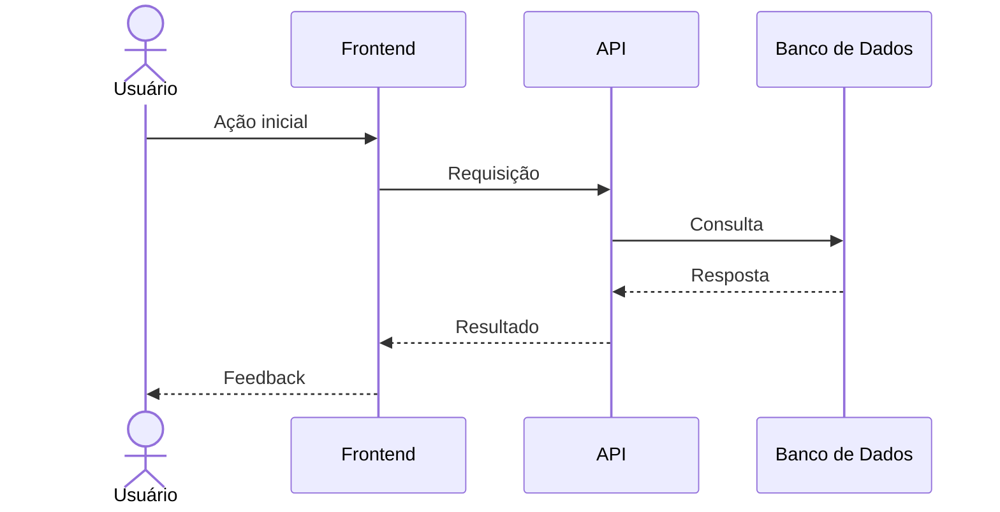
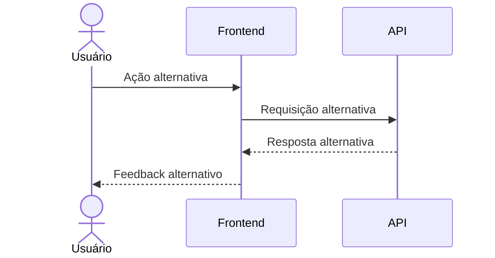
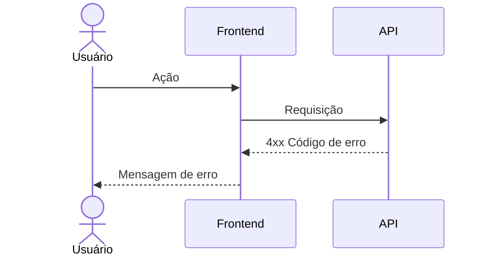
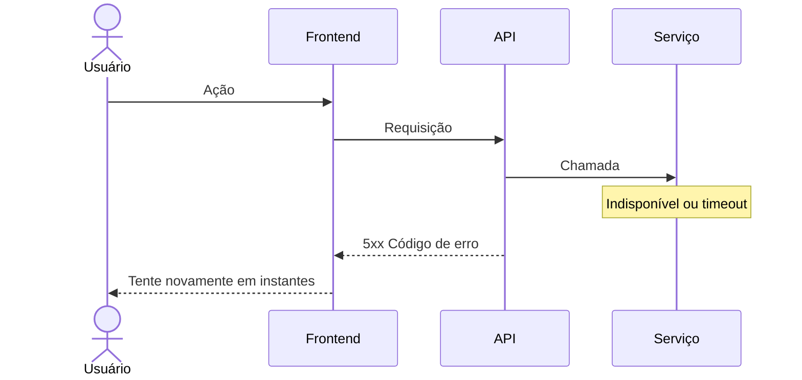
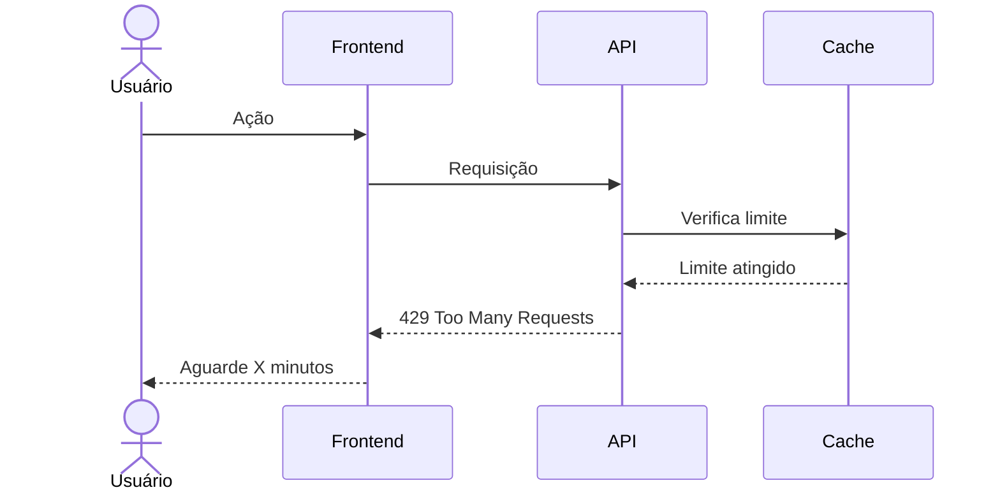

# [Nome do fluxo] — Diagrama de sequência

---

## 1. Pré-condições e pós-condições

### Pré-condições

Liste o que deve ser verdadeiro antes do fluxo iniciar:

- [ ] Condição 1 (ex: usuário possui cadastro ativo no sistema)
- [ ] Condição 2 (ex: serviço de autenticação está disponível)
- [ ] Condição 3 (ex: conexão com o banco de dados estabelecida)

### Pós-condições

Liste o estado esperado ao final do fluxo com sucesso:

- [ ] Pós-condição 1 (ex: sessão criada e token JWT emitido)
- [ ] Pós-condição 2 (ex: último acesso do usuário atualizado)
- [ ] Pós-condição 3 (ex: log de autenticação registrado)

---

## 2. Diagrama de sequência

### Fluxo principal (caminho feliz)

### Fluxo alternativo (opcional)

> Descreva aqui quando este fluxo alternativo ocorre e como ele difere do principal.

---

## 3. Fluxos de erro

### Tabela de referência rápida

| ID | Cenário | Condição de disparo | Resposta ao usuário | HTTP |
|----|---------|---------------------|---------------------|------|
| E1 | [Nome do erro] | [O que causou] | [Mensagem exibida] | 4xx |
| E2 | [Nome do erro] | [O que causou] | [Mensagem exibida] | 5xx |
| E3 | [Nome do erro] | [O que causou] | [Mensagem exibida] | 4xx |

---

### E1 — [Nome do cenário de erro]

**Condição:** descreva quando este erro ocorre.

**Decisão:** explique a escolha técnica ou de segurança por trás do comportamento.

---

### E2 — [Nome do cenário de erro]

**Condição:** descreva quando este erro ocorre.

**Decisão:** explique o comportamento de fallback ou retry adotado.

---

### E3 — [Nome do cenário de erro]

**Condição:** descreva quando este erro ocorre.

**Decisão:** explique a estratégia de rate limiting ou bloqueio adotada.
